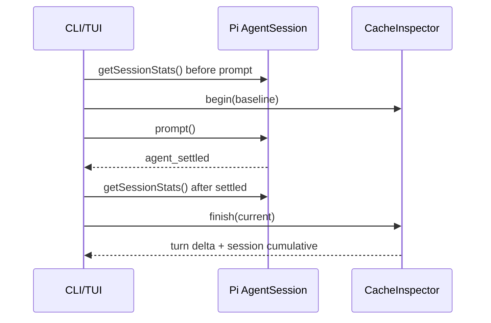

# Cache Inspector 设计

> 实现日期：2026-07-16
> 项目开发起点：`a2bf7a4`
> Pi 研究基线：`dcfe36c79702ec240b146c45f167ab75ecddd205`
> Pi SDK：`@earendil-works/pi-coding-agent@0.80.7`

## 1. 目标

Cache Inspector 将 DeepSeek 上下文缓存从评测指标变成日常可见的产品反馈：

- 每轮 settled 后显示本轮 cache hit、miss、prompt token 和命中率。
- 同时显示当前 Session 的累计缓存数据。
- `/cache` 可随时重看最近一轮，并刷新 Session 累计值。
- 只对足量相邻轮次的显著下降告警，不推测原因。

本功能不修改请求、不解析 SSE、不触发额外模型调用，也不声称缓存可以由客户端强制命中。

## 2. 源码确认事实

DeepSeek [Context Caching](https://api-docs.deepseek.com/guides/kv_cache/) 当前说明：缓存默认开启，按完整重叠前缀 best-effort 命中；响应 usage 返回 `prompt_cache_hit_tokens` 与 `prompt_cache_miss_tokens`。

Pi `packages/ai/src/api/openai-completions.ts` 的 `parseChunkUsage()` 将：

- `prompt_cache_hit_tokens` 映射为 `usage.cacheRead`。
- `prompt_tokens - cacheRead - cacheWrite` 映射为 `usage.input`。
- input、cacheRead、cacheWrite 分别进入统一 usage 与成本计算。

Pi `packages/coding-agent/src/core/agent-session.ts` 的 `getSessionStats()` 遍历整个 Session 的 message entries，累加所有 assistant usage；注释明确包含已被 Compaction 移出上下文的历史，以反映实际计费。

因此，本项目不直接读取 DeepSeek 响应字段，而只消费安装版 SDK 的 `SessionStats.tokens`。

## 3. 计算模型

```text
hit    = cacheRead
miss   = input + cacheWrite
prompt = hit + miss
rate   = hit / prompt
```

当前 DeepSeek usage 的 cacheWrite 为 0；仍把 cacheWrite 纳入非命中输入，保持与 Pi 统一 token 模型一致。prompt 为 0 时显示 `n/a`，不伪造 0% 命中率。

### 本轮与 Session



本轮数值来自前后累计快照的非负差值；任何计数倒退都显示 `turn unavailable`，不截断成伪造的 0。Session 数值始终直接来自当前累计 stats。

## 4. 下降告警

相邻两个已观察轮次同时满足以下条件才告警：

1. 两轮 prompt token 均不少于 100。
2. 当前命中率比上一轮下降至少 20 个百分点。

告警只显示实际下降百分点，例如：

```text
Cache hit rate decreased 24.3 percentage points from the previous observed turn.
```

它不会自动归因为 System Prompt、工具 Schema、AGENTS、Compaction 或 Provider 缓存淘汰。官方说明缓存是 best-effort 且可能在数小时至数天内清理，单次下降不足以确认原因。

## 5. 产品展示

CLI：

```text
[cache]
turn hit=9,200 miss=800 rate=92.0% prompt=10,000
session hit=24,000 miss=2,000 rate=92.3% prompt=26,000
```

TUI 每轮显示 `CACHE INSPECTOR` 卡片；显著下降时标题变为 `CACHE INSPECTOR · DECLINE`。`/cache` 在没有本进程轮次数据时仍可展示恢复 Session 的累计值，但本轮显示 unavailable。

## 6. 已知限制

- 本轮可能包含多次 Provider 请求和工具循环，展示的是整轮聚合，不是逐请求明细。
- 启动新进程或 resume 后没有上一轮进程内基线，因此不会立即做下降比较。
- Session 累计包含所有 JSONL entries 和已 Compaction 历史，代表计费总量，不代表当前上下文窗口。
- 当前没有保存缓存时间序列，避免引入第二套持久化协议。
- 命中率是观测指标，不直接证明任务质量或成本最优。

## 7. 验证范围

- 单轮 delta 与 Session 累计公式。
- 0 token、计数倒退和 cacheWrite。
- 100 token / 20pp 告警门槛。
- `/cache` 的 Session 累计刷新。
- CLI 输出与 80×24 TUI 卡片。
- 自动化全部使用 SessionStats 替身，不调用真实 API。

2026-07-16 验证结果：

- `npm run check`、`npm run build`、49/49 自动化测试通过。
- `deepseek-v4-flash + high + auto-read` 极短 Smoke 完成 `ls → Tool Result → settled → Cache Inspector`。
- Smoke 本轮 hit 11,392、miss 245、rate 97.9%，无 Provider 错误或下降误告警。
- 该单次结果只证明 usage 映射和展示链路可用，不证明缓存策略优于其他方案。
- Smoke 未输出或保存模型回答、reasoning、工具内容、会话和密钥。
