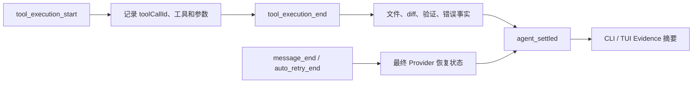

# Completion Evidence 设计

> 实现日期：2026-07-16
> 项目开发起点：`dff69d9`
> Pi 研究基线：`dcfe36c79702ec240b146c45f167ab75ecddd205`
> Pi SDK：`@earendil-works/pi-coding-agent@0.80.7`

## 1. 目标

Coding Agent 的最终文字不能单独证明任务完成。本功能在每次 Pi `agent_settled` 后展示可观察证据，帮助用户判断：

- 哪些文件被 write/edit 明确修改。
- Agent 是否真正读取过 `git diff` 内容。
- 哪些可识别检查最近一次通过或失败。
- 本轮出现过多少工具错误。
- 最终 Provider 错误是否被观察到恢复。

它是产品层证据摘要，不是新的 Agent Loop，也不是强制完成门禁。

## 2. 真实事件边界



采用 `agent_settled` 而不是 `agent_end` 作为展示点，因为 Pi 在 `agent_end` 后仍可能进行自动重试、Compaction 或队列 continuation。采集器只消费 `AgentSessionEvent`，不会修改消息或触发新请求。

## 3. 证据语义

| 字段 | 确认事实 | 明确不声称 |
|---|---|---|
| `changedFiles` | 成功 write/edit 的 `path` | Bash 没有修改其他文件 |
| `diffReviewed` | 成功 Bash 执行了会返回实际内容的 `git diff` | `git status`、`git diff --stat` 或 `--check` 等于代码审阅 |
| `checks` | 白名单验证命令的最近可观察结果 | 任意 Bash 都是测试；组合失败中的具体失败步骤 |
| `toolErrorsObserved` | 本轮产生过错误 Tool Result | 所有工具错误仍未解决 |
| `providerErrorUnresolved` | 最后的错误/重试事件未显示恢复 | Provider 之外不存在逻辑错误 |

当 write/edit 已发生但没有实际 diff 或可识别验证时，界面显示 `REVIEW`，但不会自动发送一轮“请继续验证”。这避免隐藏成本，也避免 Runtime 替模型猜测任务完成条件。

## 4. 验证命令识别

当前只识别稳定、常见且可解释的入口：

- npm/pnpm/yarn/bun 的 test、check、lint、build。
- TypeScript、pytest、ruff、Cargo、Go、Maven、Gradle 测试。
- `git diff --check` 作为 whitespace 检查，但不计为 diff review。

命令按 `&&`、`;` 和换行保守分段。多个识别检查整体成功时分别记为 passed；组合命令失败时只记录 `combined validation:failed`，因为单个 Bash 退出码不能证明具体哪一段失败。

## 5. 产品展示

一次性 CLI 输出：

```text
[evidence]
files=src/example.ts
diff=reviewed
checks=npm test:passed
bash=2 · tool-errors=0
```

TUI 在 settled 后显示紧凑卡片。存在证据缺口或失败时标题为 `COMPLETION EVIDENCE · REVIEW`；否则显示成功色。页脚固定说明这是 observed facts，并且没有额外模型请求。

## 6. 已知限制与后续门槛

- Bash 可以修改文件，但 Pi 当前工具结果不提供文件变更清单，因此只记录 Bash 被执行，不猜文件。
- 验证白名单是保守启发式，不尝试完整解析 Shell。
- 预先存在的工作区修改和本轮修改仍需结合 Git 状态判断。
- 当前不阻止 Agent 完成。只有评测证明提示型 Evidence 仍频繁遗漏必要验证后，才考虑可配置 Completion Gate。
- 后续可以在不增加模型调用的前提下加入基线/结束 Git porcelain 差异，但必须正确处理 rename、空格路径和用户既有修改。

## 7. 自动化覆盖

- 工具 start/end 配对和 write/edit 文件去重。
- 实际 diff 与 status-only diff 的区分。
- 单检查、成功组合检查和失败组合检查。
- Provider 重试失败与恢复。
- CLI Evidence 和 TUI settled 卡片。
- 全部测试使用事件替身，不访问真实 API。

2026-07-16 验证结果：

- `npm run check`、`npm run build`、45/45 自动化测试通过。
- `deepseek-v4-flash + high + auto-read` 极短 Smoke 完成 `ls → tool result → agent settled → Evidence`。
- Smoke 最终文本精确匹配，无 Provider 错误；只读任务没有被误报为缺少 diff/验证。
- Smoke 只输出模型 ID 和事件布尔摘要，没有保存 reasoning、工具内容、会话或密钥。
