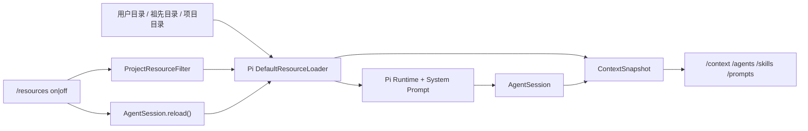

# M4 上下文资源透明化设计

> Pi SDK：`@earendil-works/pi-coding-agent@0.80.7`
> Pi 研究基线：`dcfe36c79702ec240b146c45f167ab75ecddd205`
> 最近验证：2026-07-15

## 1. 目标与边界

M4 让用户能回答“这一轮模型实际带了哪些项目指令和工具”，同时继续由 Pi 负责资源发现、命令展开和 System Prompt 构建。

本项目不复制 Pi 的扫描规则，不实现资源编辑器，也不把关闭项目上下文等同于允许或拒绝工具。第三方 Extension 仍按 M2 安全策略禁用，因为 Extension 是可执行代码，不是纯提示资源。

## 2. 真实数据来源

| 展示内容 | Pi API | 本项目处理 |
|---|---|---|
| AGENTS.md | `ResourceLoader.getAgentsFiles()` | 保留加载顺序，标注 user/ancestor/project |
| Skills | `ResourceLoader.getSkills()` | 展示 `sourceInfo.scope`、描述和模型可见性 |
| Prompt Templates | `ResourceLoader.getPrompts()` | 展示来源、描述和字符数 |
| 有效 System Prompt | `AgentSession.systemPrompt` | 统计字符数，按 4 字符约 1 token 粗估 |
| 活动工具 | `AgentSession.getActiveToolNames()` | 展示真正交给 Agent Loop 的工具名 |

“事实”是 loader 当前返回的路径、顺序、作用域、字符数和活动工具；“估算”只有 System Prompt token。Skills 的完整正文仍由 Pi 的 skill tool 按需读取，不应把发现到的所有 Skill 内容都算入基础 System Prompt。

## 3. 加载与切换流程

默认开启项目资源。用户在 Session 空闲时执行 `/resources off`：

1. loader overrides 移除项目级 Skills/Prompts。
2. AGENTS 只保留 Pi agentDir 下的用户级文件，移除祖先与项目 AGENTS。
3. 调用 `AgentSession.reload()`，由 Pi 重新发现资源、重建 runtime 和有效 System Prompt。
4. TUI 再从同一个 loader 读取新快照；失败时恢复原开关并再次 reload。

用户级 Skills/Prompts 始终保留，开关只存在当前进程内。这样既能排查仓库指令冲突，也不会把用户自己的通用工作流意外清空。

## 4. 命令语义

- `/context`：有效 System Prompt 字符数/粗略 token、活动工具、AGENTS、Skills、Prompts 和 diagnostics 摘要。
- `/agents`：严格按 Pi 返回顺序展示 AGENTS；这也是内容进入上下文的顺序。
- `/skills`：展示名称、作用域、路径、描述以及 model-visible/explicit-only。
- `/prompts`：展示名称、作用域、路径、描述和内容字符数。
- `/resources`：查看当前开关；`on|off` 在 idle 时热重载。
- `/skill:name args`：交给 Pi 原生命令展开。
- `/name args`：若命中 Prompt Template，交给 Pi 原生命令展开。

## 5. 两条独立安全边界

| 边界 | 控制的问题 | 不控制的问题 |
|---|---|---|
| 项目资源开关 | 仓库/祖先指令是否进入模型上下文 | read/write/edit/bash 是否执行 |
| 工具审批策略 | 模型提出的本地动作是否被允许 | 模型读到哪些 AGENTS/Skills/Prompts |

因此，`/resources off` 后审批模式保持 `ask/auto-read/deny` 原值；反过来，批准某次 write 也不代表永久信任项目指令。审批仍不是 OS 沙箱。

## 6. 验证与限制

自动化使用临时目录和真实 `DefaultResourceLoader`，验证全局 → 祖先 → 项目 AGENTS 顺序、资源作用域、过滤前后 System Prompt 和 `AgentSession.reload()`。虚拟 80×24 TUI 验证所有命令、资源切换以及 Skill/Prompt 显式调用的分发。

当前限制：

- token 是跨模型通用粗估，不是 DeepSeek tokenizer 精确值。
- diagnostics 当前随 Skills/Prompts 聚合展示，没有单独详情页。
- 没有持久化资源开关、资源选择器或单项启停。
- 不展示全部 System Prompt 正文，避免终端噪声和意外回显敏感上下文。
