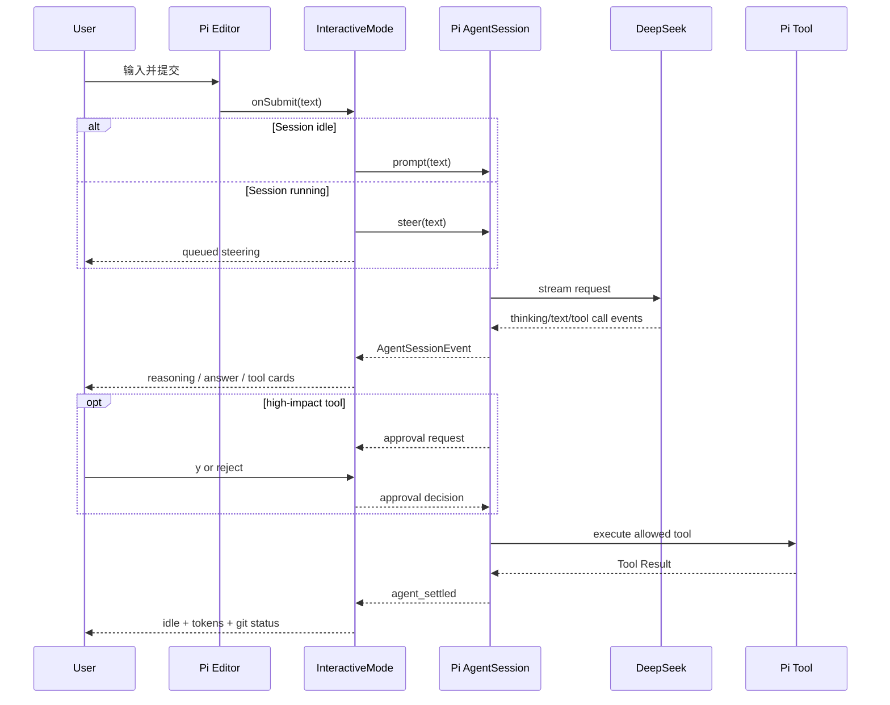

# M3–M6 交互式终端设计

> 实现版本：M3–M6
> Pi SDK / TUI：`0.80.7`
> Pi 研究基线：`dcfe36c79702ec240b146c45f167ab75ecddd205`
> 最近验证：2026-07-16

## 1. 目标与非目标

M3 把一次性 CLI 升级为持续使用的终端，M4 增加上下文透明化，M5 把内存 Session 替换为 Pi JSONL 持久会话。

当前实现多轮输入、流式展示、工具状态、审批、取消、上下文资源和文本式会话管理；仍不复制完整 Pi InteractiveMode，不实现 MCP 或多 Agent。

## 2. 复用边界

| 能力 | 来源 | 本项目职责 |
|---|---|---|
| raw terminal、输入拆分、差分刷新 | Pi `ProcessTerminal` / `TUI` | 组装页面和生命周期 |
| 多行编辑、历史和快捷键解析 | Pi `Editor` / `matchesKey` | 提交、Ctrl+C 和命令分发 |
| Markdown 流式渲染 | Pi `Markdown` | 管理当前 assistant 内容 |
| 多轮、steering、取消 | Pi `AgentSession` | 选择产品默认行为并展示状态 |
| 模型、thinking、统计 | Pi `AgentSession` / `ModelRegistry` | 只暴露 DeepSeek 命令 |
| 工具审批 | M2 Inline Extension | 将审批请求接入 TUI |
| JSONL、恢复、树与 Compaction | Pi `SessionManager` / `AgentSession` | 启动选择、命令和安全约束 |

没有复制 Pi 的完整 `InteractiveMode`。本项目只提供适合本地演示的文本式会话树，不复制上游选择器、扩展 UI 和完整命令面。

## 3. 主流程

## 4. 页面结构与状态

页面从上到下是：深海蓝标题与快捷键提示、滚动 transcript、单行状态栏、多行 Editor。标题使用原创 `◆ DEEPSEEK CODE` 字标和冰青/海蓝配色，不使用官方 Logo；右侧明确显示项目上下文 ON/OFF。

transcript 只保存当前进程内的展示组件：

- 用户消息。
- assistant Markdown 块。
- reasoning 块，默认只显示字符数。
- tool running/done/failed 卡片；失败结果明确说明已回填 Agent Loop。
- approval waiting/approved/rejected 卡片。
- 系统、重试、错误和 Git 状态。Provider 错误卡显示分类、HTTP 状态（若有）、脱敏详情和下一步动作；自动重试结束后原地变为 recovered/exhausted 状态。
- Cache Inspector 卡显示本轮与 Session 累计 hit/miss/rate；显著下降只报告实际百分点。

错误与恢复卡由宽度感知组件渲染，正文和动作各最多两行；在 80 列终端中保持紧凑，超长脱敏详情显示省略号。卡片只解释 Pi 事件，不创建第二套重试状态机。

状态栏显示 `state | provider/model | session | tokens | cwd`。token 是 Pi 对当前 JSONL 全历史累计的 usage，不是精确实时计费器。

### 4.1 视觉与动态规范

- 主色使用原创深海蓝，交互强调使用冰青；成功、警告、失败分别使用低饱和绿、琥珀和珊瑚红。
- 颜色只用于强化层级，所有状态同时具有图标或文字，保证无色终端仍可理解。
- 标题、状态栏、工具卡和恢复卡共享同一语义色，不为每个功能增加独立颜色。
- 流式文本依赖 Pi 差分刷新，不做全屏清空；动态效果只表达真实状态变化，不加入装饰性延迟。
- 预计超过 300ms 的模型、工具、Compaction 和 reload 才展示 spinner 或阶段状态；完成、失败、取消必须原地收束到稳定状态。
- 80×24 是最低验收尺寸，100×30 是日常基线，120×40 用于检查宽屏信息密度；长路径和详情必须宽度感知地截断。
- 非 TTY 或设置 `NO_COLOR` 时退化为纯文本，不输出 ANSI 控制序列。

Doctor 是该规范的第一个独立入口：TTY 下使用相同深海蓝/冰青语义色，快速离线检查不伪造 loading 动画，长 cwd 按终端宽度保留尾部。

## 5. 输入、排队和取消

- Enter 提交；Shift+Enter 由 Pi Editor 处理为换行。
- Session 空闲时调用 `prompt()`。
- Session 运行时调用 `steer()`，在当前 assistant turn 的工具执行完成后、下一次模型调用前注入。
- Ctrl+C 在运行时调用 `abort()` 并等待回到 idle，同时留下 `RUN CANCELLED · Session ready` 恢复卡。
- 空闲时第一次 Ctrl+C 给出提示，1.5 秒内第二次退出。
- 审批等待时 Ctrl+C 只拒绝当前工具，不退出会话。

当前没有单独的 follow-up 快捷键；选择 steering 是为了让长编码任务能及时纠偏。后续只有在实际使用证明需要时再增加两种队列的显式选择。

## 6. 命令

| 命令 | 行为 |
|---|---|
| `/help` | 显示命令列表 |
| `/status` | 显示模型、Agent 模式、thinking、审批、消息和 token |
| `/cache` | 显示最近一轮与当前 Session 的 DeepSeek cache hit/miss/rate |
| `/session` | 显示当前 ID、标题、文件、cwd、模型、消息和 Compaction 状态 |
| `/sessions` | 显示当前工作区最近会话，星号标记当前会话 |
| `/name <title>` | 设置并持久化会话标题 |
| `/compact [instructions]` | 调用 Pi 手动 Compaction，并显示压缩前后 token |
| `/tree [entry-id]` | 展示消息树，或将 leaf 移到指定 ID 前缀 |
| `/fork <entry-id>` | 从已完成的节点创建单分支 JSONL |
| `/clone` | 复制当前完整 JSONL 树 |
| `/model [id]` | 列出或切换已认证 DeepSeek 模型 |
| `/mode [plan\|build]` | 查看或在空闲时切换只读 Plan / 可修改 Build 工具集合 |
| `/thinking [level]` | 查看或设置当前模型支持的 thinking level |
| `/reasoning` | 展开或折叠当前 transcript 中的 reasoning |
| `/context` | 显示有效 System Prompt 大小、工具和资源摘要 |
| `/agents` | 按真实加载顺序显示 AGENTS.md 路径、作用域和字符数 |
| `/skills` | 显示 Skill 名称、路径、作用域和是否对模型可见 |
| `/prompts` | 显示 Prompt Template 名称、路径和作用域 |
| `/resources [on\|off]` | 查看或临时开关项目资源，并触发 Pi Session reload |
| `/clear` | 清空模型/UI 并 reset leaf；下一条消息形成新 root，旧历史不删除 |
| `/exit` | 取消活动运行后安全退出 |

`/model` 继续通过 DeepSeek-only resolver，不能切换到 OpenAI、Anthropic 或其他 Provider。

`/mode` 调用产品策略与 Pi `AgentSession.setActiveToolsByName()`：Plan 只保留 read/ls/grep，Build 恢复审批模式允许的集合。切换会让 Pi 重建 System Prompt，并从下一轮生效；活动请求、Compaction 和审批等待期间拒绝切换。

未知斜杠命令会先与当前 ResourceLoader 的 `/skill:name` 和 Prompt Template `/name` 匹配；命中后原样交给 Pi 展开。只有未命中资源时才显示 unknown command。

## 7. 审批与安全

TUI 启动前创建 M2 ToolPolicy，审批回调在 InteractiveMode 创建后绑定。write/edit/bash 的预览显示在 transcript：`y`/`yes` 允许一次；Bash 可用 `a`/`always` 在当前进程允许完全相同的命令；其余输入和 Ctrl+C 拒绝。write/edit 不提供 Session 授权。

精确 Bash 授权由 ToolPolicy 内存 Set 持有，不写入 JSONL。命令字符串变化后重新审批；敏感路径和危险命令检查先于 Set 查询，不能被已有授权绕过。

审批仍不是沙箱；批准 Bash 后拥有本地用户权限。路径、symlink、危险命令和第三方 Extension 边界保持 `docs/tool-safety.md` 中的定义。

## 8. 验证

自动化虚拟终端固定为 80×24，覆盖：

- 连续三轮 prompt。
- reasoning 默认折叠和历史展开。
- tool start/end 卡片。
- Provider 错误分类、自动重试 recovered/exhausted 卡片。
- write 审批接受。
- Bash 允许一次、当前进程精确授权和拒绝结果。
- DeepSeek 模型与 thinking 切换。
- Plan/Build 热切换后活动工具集合同步变化。
- 活动请求 steering 和 Ctrl+C abort。
- 取消后显示 Session ready，失败或取消不会让状态栏永久停在 error/cancelling。
- `/clear` 与 `/exit`。

真实验证分为两类：

1. `ProcessTerminal` 启动、`/status`、`/exit`，确认 raw mode 和 shell 恢复。
2. 真实 DeepSeek 请求产生 write Tool Call，在 TUI 拒绝后返回 idle，临时文件未创建。

自动化不访问真实 API。真实 Smoke 不保存完整会话、reasoning 或密钥。

## 9. 已知限制与下一步

- transcript 的屏幕布局不会恢复，但模型消息、树、标题、模型/thinking 变化和 Compaction 会恢复。
- `/clear` 不删除 append-only JSONL；若清空后直接退出而没有新消息，resume 仍回到文件最后 leaf。
- fork/clone 创建后留在当前会话，避免在没有完整 Runtime replacement 的情况下制造内存/文件状态漂移。
- 工具结果只展示短摘要，没有展开面板或结果搜索。
- UI 使用固定轻量 ANSI 配色，没有主题系统。
- `/context` 使用字符数除以 4 粗估 System Prompt token，不替代 Provider tokenizer。
- 资源开关只影响当前进程，重启后默认恢复开启；持久配置留给后续真实使用反馈决定。
