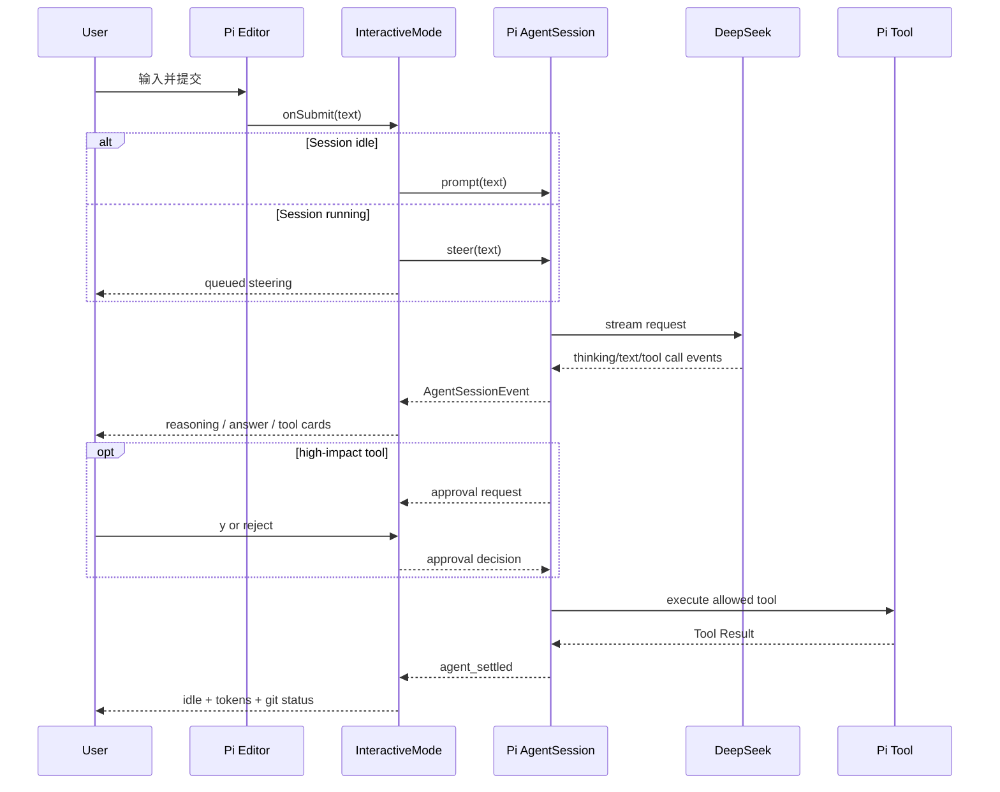

# M3 交互式终端设计

> 实现版本：M3
> Pi SDK / TUI：`0.80.7`
> Pi 研究基线：`dcfe36c79702ec240b146c45f167ab75ecddd205`
> 最近验证：2026-07-15

## 1. 目标与非目标

M3 把一次性 CLI 升级为可持续使用的单 Session 终端，同时保留 M1 的 DeepSeek-only 策略和 M2 的工具审批边界。

本阶段实现多轮输入、流式展示、工具状态、审批、取消和常用命令；不实现持久会话、Compaction、完整 Pi InteractiveMode、MCP 或多 Agent。

## 2. 复用边界

| 能力 | 来源 | 本项目职责 |
|---|---|---|
| raw terminal、输入拆分、差分刷新 | Pi `ProcessTerminal` / `TUI` | 组装页面和生命周期 |
| 多行编辑、历史和快捷键解析 | Pi `Editor` / `matchesKey` | 提交、Ctrl+C 和命令分发 |
| Markdown 流式渲染 | Pi `Markdown` | 管理当前 assistant 内容 |
| 多轮、steering、取消 | Pi `AgentSession` | 选择产品默认行为并展示状态 |
| 模型、thinking、统计 | Pi `AgentSession` / `ModelRegistry` | 只暴露 DeepSeek 命令 |
| 工具审批 | M2 Inline Extension | 将审批请求接入 TUI |

没有复制 Pi 的完整 `InteractiveMode`。其会话树、主题、扩展 UI、选择器和大量命令超出当前个人项目里程碑。

## 3. 主流程

## 4. 页面结构与状态

页面从上到下是：标题与快捷键提示、滚动 transcript、单行状态栏、多行 Editor。

transcript 只保存当前进程内的展示组件：

- 用户消息。
- assistant Markdown 块。
- reasoning 块，默认只显示字符数。
- tool running/done/failed 卡片。
- approval waiting/approved/rejected 卡片。
- 系统、重试、错误和 Git 状态。

状态栏显示 `state | provider/model | thinking | tokens | cwd`。其中 token 是当前内存 SessionManager 的累计 usage，不是精确实时计费器。

## 5. 输入、排队和取消

- Enter 提交；Shift+Enter 由 Pi Editor 处理为换行。
- Session 空闲时调用 `prompt()`。
- Session 运行时调用 `steer()`，在当前 assistant turn 的工具执行完成后、下一次模型调用前注入。
- Ctrl+C 在运行时调用 `abort()` 并等待回到 idle。
- 空闲时第一次 Ctrl+C 给出提示，1.5 秒内第二次退出。
- 审批等待时 Ctrl+C 只拒绝当前工具，不退出会话。

当前没有单独的 follow-up 快捷键；选择 steering 是为了让长编码任务能及时纠偏。后续只有在实际使用证明需要时再增加两种队列的显式选择。

## 6. 命令

| 命令 | 行为 |
|---|---|
| `/help` | 显示命令列表 |
| `/status` | 显示模型、thinking、审批、消息和 token |
| `/model [id]` | 列出或切换已认证 DeepSeek 模型 |
| `/thinking [level]` | 查看或设置当前模型支持的 thinking level |
| `/reasoning` | 展开或折叠当前 transcript 中的 reasoning |
| `/clear` | 清空 Agent transcript 和界面；累计 Session 统计仍保留 |
| `/exit` | 取消活动运行后安全退出 |

`/model` 继续通过 DeepSeek-only resolver，不能切换到 OpenAI、Anthropic 或其他 Provider。

## 7. 审批与安全

TUI 启动前创建 M2 ToolPolicy，审批回调在 InteractiveMode 创建后绑定。write/edit/bash 的预览显示在 transcript，用户输入 `y`/`yes` 才允许，其余输入和 Ctrl+C 都拒绝。

审批仍不是沙箱；批准 Bash 后拥有本地用户权限。路径、symlink、危险命令和第三方 Extension 边界保持 `docs/tool-safety.md` 中的定义。

## 8. 验证

自动化虚拟终端固定为 80×24，覆盖：

- 连续三轮 prompt。
- reasoning 默认折叠和历史展开。
- tool start/end 卡片。
- write 审批接受。
- DeepSeek 模型与 thinking 切换。
- 活动请求 steering 和 Ctrl+C abort。
- `/clear` 与 `/exit`。

真实验证分为两类：

1. `ProcessTerminal` 启动、`/status`、`/exit`，确认 raw mode 和 shell 恢复。
2. 真实 DeepSeek 请求产生 write Tool Call，在 TUI 拒绝后返回 idle，临时文件未创建。

自动化不访问真实 API。真实 Smoke 不保存完整会话、reasoning 或密钥。

## 9. 已知限制与下一步

- transcript 会随进程结束丢失；M5 才接入 Session JSONL。
- `/clear` 清空模型上下文，但 SessionManager 的累计 usage 不归零。
- 工具结果只展示短摘要，没有展开面板或结果搜索。
- UI 使用固定轻量 ANSI 配色，没有主题系统。
- M4 将增加 AGENTS、Skills、Prompt Templates 和信任状态的可见性。
