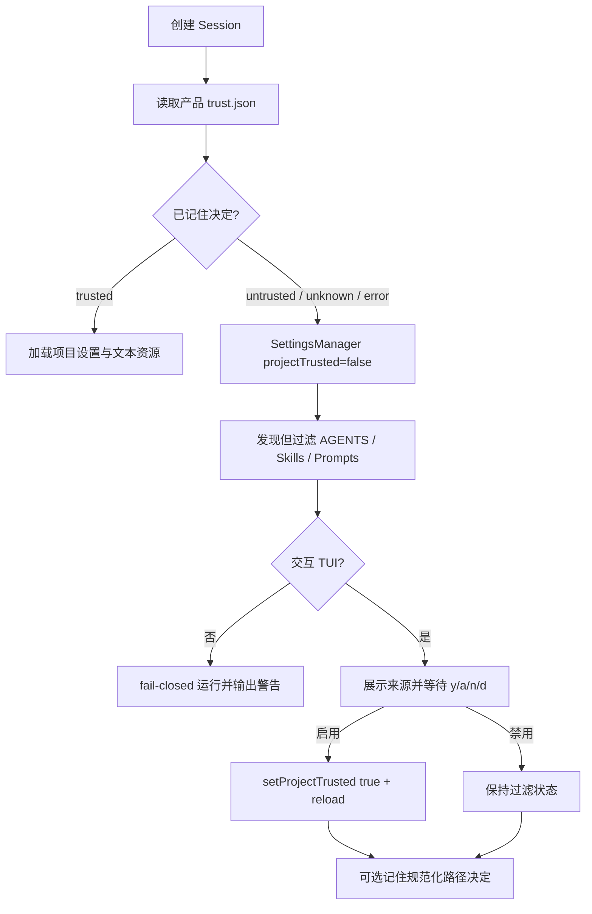

# 本地设置与项目上下文信任

> 实现状态：P1-A 核心范围完成
> Pi SDK：`@earendil-works/pi-coding-agent@0.80.7`
> Pi 研究基线：`dcfe36c79702ec240b146c45f167ab75ecddd205`
> 最近验证：2026-07-16

## 1. 目标

这一层解决两个日用问题：常用启动参数不必重复输入；陌生仓库中的项目指令不能在用户看见之前进入模型上下文。它不负责保存凭据，也不替代 write/edit/bash 的工具审批。

## 2. 用户设置

设置文件固定为 `~/.pi/agent/deepseek-code/settings.json`（准确根目录仍跟随 Pi `getAgentDir()`）。只允许以下字段：

```json
{
  "version": 1,
  "model": "deepseek-v4-flash",
  "thinking": "high",
  "mode": "build",
  "approval": "ask",
  "showReasoning": false
}
```

- `model` 仍经过 DeepSeek-only ModelRegistry 校验；保存值不会引入 Provider 回退。
- 显式 CLI 参数覆盖保存值，适合脚本和一次性运行。
- `/model`、`/thinking`、`/mode`、`/reasoning` 保存相应偏好；`/settings approval <mode>` 只保存下一次启动值。
- 文件目录以 `0700` 创建，文件以 `0600` 写入，并通过同目录临时文件原子替换（`src/product-settings.ts:77` `ProductSettingsStore`、`:107` `update()`）。
- 未知字段（包括尝试写入 `apiKey`）会使文件无效。解析失败后使用 `flash/high/build/ask/reasoning hidden`，显示错误，并在人工修复前拒绝覆盖原文件（`src/product-settings.ts:37` `parseSettingsFile()`、`:92` `getPreferences()`）。

API Key 继续只来自环境变量、本地忽略的 `.env` 或 Pi AuthStorage；设置 UI 不读取或展示具体值。

## 3. 信任启动流程



产品复用 Pi `ProjectTrustStore` 的规范化路径、最近祖先匹配、文件锁和读写格式（Pi `packages/coding-agent/src/core/trust-manager.ts:208` `ProjectTrustStore`）。Pi 自身将 `.pi` 资源和祖先 `.agents/skills` 识别为需要信任的项目资源（同文件 `hasTrustRequiringProjectResources()`，`:184`）。本项目额外通过 ResourceLoader override 记录真实发现的项目/祖先 AGENTS、Skills 和 Prompts，从而覆盖 Pi 检测函数不包含普通 AGENTS.md 的情况（`src/context-resources.ts:62` `createProjectResourceFilter()`）。

启动时先用 `SettingsManager.create(..., { projectTrusted: false })`，因此未信任项目的 `.pi/settings.json` 不会载入；Pi 的对应行为位于 `packages/coding-agent/src/core/settings-manager.ts:319` `fromStorage()` 和 `:350` `loadFromStorage()`。作出决定后，产品同步切换 SettingsManager 与资源过滤器，再调用 `AgentSession.reload()`（`src/main.ts:274` `setProjectTrust`）。Pi 的 `setProjectTrusted(false)` 会清空项目设置并只保留全局设置（Pi `settings-manager.ts:454`）。

选择语义：

| 输入 / 命令 | 项目上下文 | 是否持久化 |
|---|---|---|
| `y`、`/trust once` | 启用 | 否 |
| `a`、`/trust always` | 启用 | 是 |
| `n`、`/trust off` | 禁用 | 否 |
| `d`、`/trust deny` | 禁用 | 是 |

信任存储位于 `~/.pi/agent/deepseek-code/trust.json`，只包含规范化路径和布尔决定。损坏时按未信任处理；当前进程仍可临时选择，但不会覆盖损坏文件。

## 4. 安全边界

源码确认的事实：

- 未决定前，交互模式阻断普通任务；一次性 CLI 不询问而禁用项目上下文。
- `/resources on` 不能绕过未信任状态。
- 第三方 Extension 继续由 `noExtensions: true` 禁用（`src/main.ts:179`）。
- 项目信任与 Agent `plan/build`、工具 `ask/auto-read/deny` 完全独立。
- 保存的用户设置和 trust 文件都不包含 API Key。

设计推断：

- AGENTS.md 本身是文本，但会改变模型行为，因此应与可执行 Extension 分级处理，同时仍在首次进入陌生仓库时显式征得同意。
- approval 在运行中不热切换，避免已创建 ToolPolicy 与状态栏展示不一致；它只保存为下次启动默认值。

## 5. 当前限制

- 尚未增加本项目专属的项目级偏好文件或“建议验证命令”覆盖；`/verify` 仍从受信任工作区的固定 manifest 推导候选。
- remembered trust 按项目规范化路径和 Pi 最近祖先规则生效；移动仓库后需要重新决定。
- 信任不是内容审计：启用前仍应阅读列出的 AGENTS/Skills/Prompts。
- 这不是 OS 沙箱。批准 Bash 后仍具有当前本地用户权限。

## 6. 验证

- `test/product-settings.test.ts`：字段白名单、权限、原子保存、损坏文件安全回退和不覆盖。
- `test/project-trust.test.ts`：临时/持久决定、真实路径规范化、损坏 store fail-closed。
- `test/context-resources.test.ts`：未信任 AGENTS 被发现但不进入 System Prompt，信任 reload 后才进入。
- `test/interactive.test.ts`：80×24 信任卡、任务阻断、四种决定、设置持久化和资源绕过拒绝。
- `test/cli.test.ts`：保存默认值、显式参数优先和一次性未信任警告。
