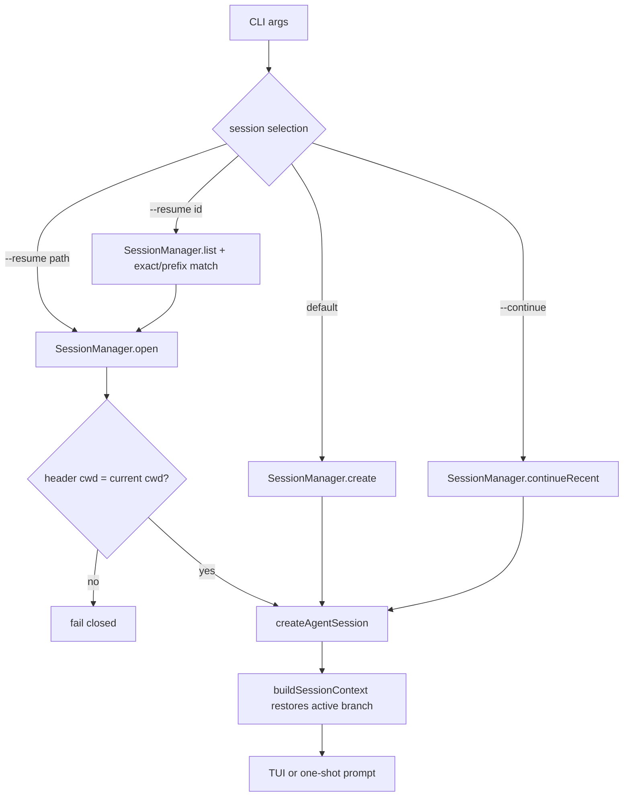
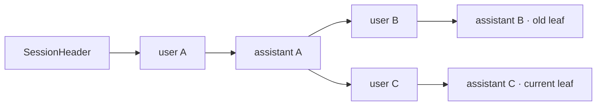
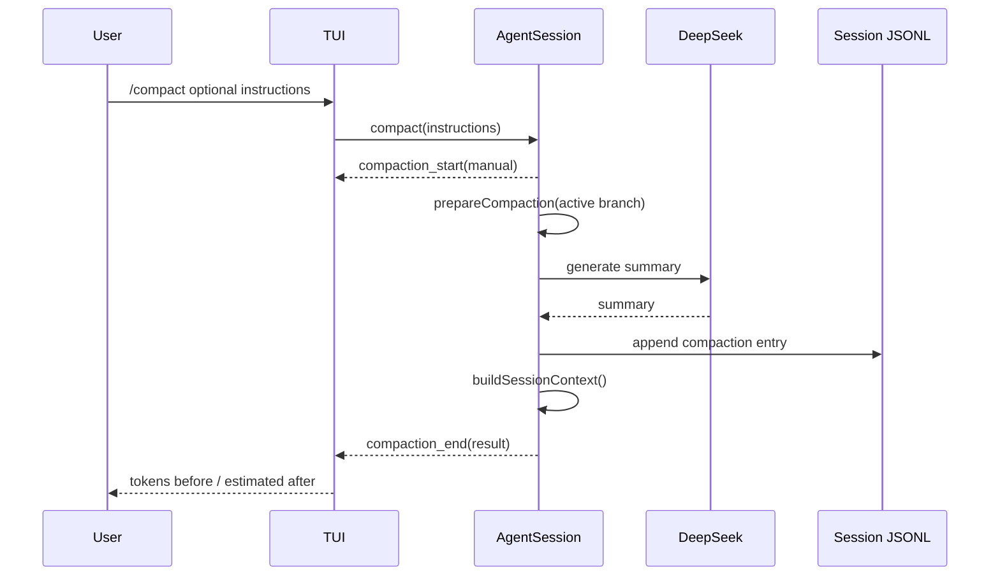

# M5 持久会话、恢复与 Compaction 设计

> Pi SDK：`@earendil-works/pi-coding-agent@0.80.7`
> Pi 研究基线：`dcfe36c79702ec240b146c45f167ab75ecddd205`
> 最近验证：2026-07-15

## 1. 目标与非目标

M5 让真实编码任务可以退出后继续，同时保持 Pi 的 append-only JSONL、消息树和 Compaction 语义。本项目只负责选择会话、限制工作区、组装命令和展示状态，不复制 Session 序列化、恢复上下文或摘要算法。

本阶段不实现图形选择器、云同步、跨设备共享、删除/重写历史或完整 Pi Runtime replacement。fork/clone 创建新会话后要求下一次用 `--resume` 进入，避免活动 Agent 的内存消息与新 JSONL 不一致。

## 2. Pi 事实与产品决策

源码/API 确认的事实：

- `SessionManager` 把 header 和 entry 持久化为 JSONL；entry 的 `id/parentId` 形成 append-only tree。
- `buildSessionContext()` 沿当前 leaf 恢复消息，并识别最新 Compaction entry。
- `SessionManager.create/open/continueRecent/list` 分别负责新建、指定恢复、最近恢复和列表。
- `AgentSession.compact()` 生成摘要、追加 Compaction entry，再用 `buildSessionContext()` 重建 Agent 消息。
- `AgentSession.navigateTree()` 在同一 JSONL 中移动 leaf，旧分支不会被删除。
- `createBranchedSession()` 会改变调用它的 SessionManager 当前文件和 ID，不是无副作用的导出函数。

本项目的设计推断与取舍：

- 会话放在 Pi agentDir 下的 `deepseek-code-sessions`，复用 Pi 存储实现但不与上游 Pi CLI 默认会话混用。
- resume 只允许 header cwd 等于当前工作区，防止恢复别处上下文后在当前目录误执行工具。
- fork 在独立打开的临时 manager 上调用 `createBranchedSession()`，不触碰活动 manager。
- `/clear` 通过 `resetLeaf()` 和 Agent reset 开始新 root，旧历史仍保留，符合 append-only 原则。

## 3. 创建与恢复流程

默认新建持久 Session。Pi 在第一次完整 assistant response 后创建实际文件，因此新 TUI 在首轮前会显示 `pending first response`。`--continue` 在当前工作区没有历史时退化为新建；`--resume` 的损坏文件、未知/重复 ID 前缀和 cwd 不匹配都会报错，不静默换成新会话。恢复时若用户没有再次指定 `--model`，产品读取 Session 的 model change 并只接受已认证 DeepSeek 模型；显式模型始终优先。

## 4. JSONL、消息树与分支

`/tree` 展示 entry ID 前缀、层级、预览和当前 leaf。`/tree <id>`调用 `navigateTree(..., { summarize: false })`；下一条消息会成为该节点的新 child。由于所有 entry 只追加，不会覆盖原来的 B 分支。

`/fork <id>`只保留 root 到目标 entry 的路径，目标必须包含已经落盘的 assistant response。`/clone`复制当前文件的完整树。两者都会设置 `parentSession`，并返回新 ID，但当前进程仍留在原会话。

## 5. Compaction 生命周期

Pi SettingsManager 保持自动 Compaction 的默认设置；阈值或 overflow 触发时使用相同事件。手动 `/compact`只在 idle 时允许。Ctrl+C 请求取消压缩；退出会 abort 活动操作并等待 `AgentSession.waitForIdle()`，再释放 Session。

Compaction 不删除旧 JSONL entry，只改变后续构建上下文时采用的路径。自动化通过手工追加 Pi Compaction entry 验证摘要、最近用户约束和旧历史同时满足预期；真实 summary 生成只在明确 Smoke/实际使用时调用 DeepSeek。

## 6. 命令与安全边界

| 命令/参数 | 行为 |
|---|---|
| `--continue`, `-c` | 恢复当前工作区最近会话；没有则新建 |
| `--resume <id\|path>`, `-r` | 精确/唯一前缀或 JSONL 路径恢复 |
| `/session` | 当前 ID、标题、文件、cwd、模型、统计、自动压缩 |
| `/sessions` | 当前工作区最近会话列表 |
| `/name <title>` | 追加 `session_info` entry |
| `/compact [instructions]` | 手动摘要当前活动分支 |
| `/tree [entry]` | 查看树或移动 leaf |
| `/fork <entry>` | 创建单分支子会话 |
| `/clone` | 创建完整树副本 |

会话恢复不改变 DeepSeek-only Provider、项目资源开关或工具审批。历史里曾经批准过某个命令，不代表恢复后自动批准下一次动作。

## 7. 已知限制

- 没有交互式 fuzzy session selector、搜索、删除、归档和批量清理。
- 不支持跨 cwd 直接打开；需要用户在目标工作区启动。
- fork/clone 后不会热切换 Session；完整热切换应基于 Pi `AgentSessionRuntime`，不在 M5 为一个命令复制上游 Runtime。
- 屏幕 transcript、折叠状态和资源开关不写入 JSONL。
- Compaction summary 的质量与成本仍需在 M6 用固定 DeepSeek 任务量化。
