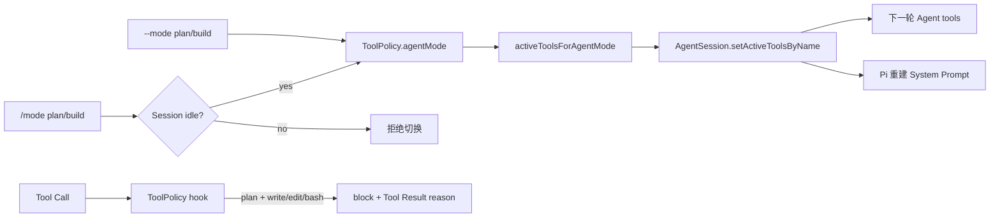

# Plan / Build 模式设计

> 最近验证：2026-07-16
> Pi SDK：`@earendil-works/pi-coding-agent@0.80.7`
> Pi 研究基线：`dcfe36c79702ec240b146c45f167ab75ecddd205`

## 1. 目标

Plan/Build 提供一个明确、可见、在工具层真实生效的工作状态：Plan 用于只读调查和形成方案，Build 用于在现有审批边界下修改与验证。它不复制 Pi Agent Loop，也不把一句 System Prompt 当成权限系统。

默认组合保持 `build + ask`，避免改变已有用户行为。

## 2. 两条独立策略轴

| Agent 模式 | `ask` | `auto-read` | `deny` |
|---|---|---|---|
| `plan` | read/ls/grep | read/ls/grep | 无工具 |
| `build` | read/ls/grep/write/edit/bash；修改逐次审批 | read/ls/grep | 无工具 |

Plan/Build 回答“模型能看到哪些能力”，approval 回答“可见能力如何授权”。Build 不是 bypass，也不会自动批准任何高影响工具。

## 3. 实现链路

启动时，`src/main.ts` 根据两个模式计算 `createAgentSession({ tools })`。TUI 热切换时，同时更新内存 ToolPolicy 并调用 Pi `setActiveToolsByName()`。已安装 SDK 类型明确说明未知工具会忽略、System Prompt 会重建、变化从下一 Agent turn 生效；相邻 Pi 源码的 `AgentSession.setActiveToolsByName()` 与 `getActiveToolNames()` 实现也与此一致。

策略钩子是第二道防线：Plan 中 write/edit/bash 在审批前直接拒绝。这样即使未来调用方绕过活动工具列表，修改工具仍不会执行。

## 4. 生命周期与缓存取舍

- `--mode` 同时适用于一次性任务和 TUI 初始状态。
- `/mode` 只允许 Session idle、无 Compaction、无审批等待时切换。
- 模式不写入 Pi Session JSONL；resume 使用当前 CLI 默认值或显式参数。
- 切换工具集合必然改变工具 Schema 和 System Prompt，因此可能降低切换后的首轮 cache hit；这是显式用户边界变化，不做隐藏优化。
- 当前不注入动态时间、随机 ID 或每轮模式说明，避免无关前缀漂移。

## 5. 明确边界

- Plan 保证没有本项目注册的修改/Shell 工具，不保证模型输出固定 JSON 或固定格式计划。
- Plan 不是 OS 沙箱；模型仍能读取工作区内文件，未来若加入其他自定义工具，必须显式分类后才能进入模式矩阵。
- Build 仍受 workspace/symlink、危险 Bash 和审批策略约束。
- 项目 Extension 仍默认禁用，不能通过第三方工具绕过模式。

## 6. 验证

自动化覆盖：

- CLI 默认 Build、显式 Plan/Build 和非法值。
- 两种 Agent 模式与三种审批模式的工具集合矩阵。
- Plan 对直接 write 调用的策略阻断，且不触发审批。
- 切到 Build 后恢复审批流程。
- 80×24 TUI `/mode plan` → `/mode build` 热切换和活动工具展示。

真实 Smoke 使用 `deepseek-v4-flash`、ephemeral Session 和极短只读提示：退出码 0，收到 Tool Call/Result 与 `agent:complete`，没有 write/edit/bash 事件，工作区前后不变。验证不记录密钥、完整 reasoning 或 Session 内容。
