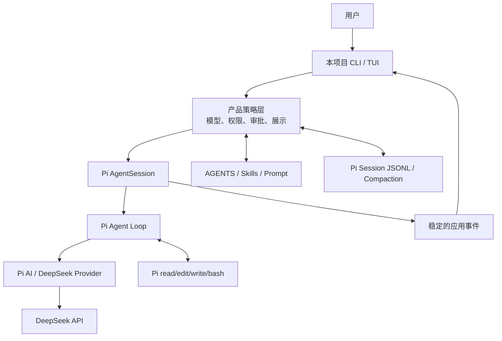

# DeepSeek Coding Agent 产品与技术路线图

> 文档性质：持续维护的产品、架构与开发决策基线
> 最近更新：2026-07-15
> M1 实现基线提交：`308daaf`
> M2 实现基线提交：`08a0dee`
> M3 实现基线提交：`4d57b48`
> M4 实现基线提交：`a68c6f5`
> M5 实现基线提交：`679bc71`
> Pi 研究基线：`dcfe36c79702ec240b146c45f167ab75ecddd205`
> 当前项目依赖：`@earendil-works/pi-coding-agent@0.80.7`
> 最近验证的 Pi 发布版：`0.80.7`
> DeepSeek 官方文档核对日期：2026-07-15
> 当前评测开发起点：`5d3007d`

## 1. 项目定位

这是一个以学习、日常本地使用和面试演示为目标的个人 Coding Agent，不追求商业化发布、多人协作平台或云端规模化。

项目要证明三件事：

1. 能够从源码层理解 Pi 的模型抽象、Agent Loop、工具、会话、上下文和 TUI，并正确复用这些能力。
2. 能够把通用 Pi SDK 组装成一个安全、流畅、适合真实编码任务的 DeepSeek Coding Agent。
3. 能够通过清晰的代码、测试、设计文档和稳定演示，说明每个产品决策为什么存在。

成功不是“功能数量最多”，而是以下体验同时成立：

- 在本地仓库中启动快、输入自然、反馈及时。
- 模型、reasoning、工具执行和错误状态都可理解。
- 修改文件和执行命令前有清晰边界，不让用户猜测 Agent 正在做什么。
- 中断、失败和恢复行为可靠，不因长任务丢失目标。
- 代码边界清晰，能向面试官解释哪些来自 Pi、哪些是本项目的产品层实现。

## 2. 明确不追求的目标

以下能力除非后续演示目标发生变化，否则不进入近期主线：

- npm 大规模发布、自动更新器和跨平台安装矩阵。
- 云端账号、计费、团队空间、远程任务和 Web 控制台。
- IDE 插件、移动端和浏览器端。
- 多 Agent 编排、通用 MCP 市场和复杂插件生态。
- 企业级 RBAC、审计平台和自建模型网关。
- 为了“看起来完整”而复制 Pi 已有的 Agent Loop、Provider、Session 或 TUI 实现。

GitHub 仍用于开源展示、版本管理和保存设计演进；项目只需保证本机安装与演示路径稳定。

## 3. 事实基线与资料来源

### 3.1 Pi 基线

本路线图参考相邻 `pi/` 仓库当前源码，主要复用边界如下：

| Pi 能力 | 关键源码 | 本项目策略 |
|---|---|---|
| Model、Provider、统一流协议 | `packages/ai/src/types.ts`、`models.ts`、`providers/deepseek.ts` | 直接复用，不重新实现 HTTP 协议 |
| Agent Loop 与 Tool Result 回填 | `packages/agent/src/agent-loop.ts`、`agent.ts` | 直接复用，只增加产品策略和展示 |
| AgentSession 与事件 | `packages/coding-agent/src/core/sdk.ts`、`agent-session.ts` | 作为应用核心，稳定包装对外事件 |
| read/write/edit/bash | `packages/coding-agent/src/core/tools/*` | 复用执行逻辑，在外层增加审批和范围限制 |
| 工具前后置 hook | `packages/agent/src/types.ts` 的 `beforeToolCall/afterToolCall`，`agent-session.ts` 的 extension bridge | 用于审批、阻断、结果裁剪和审计 |
| AGENTS、Skills、Prompts | `resource-loader.ts`、`skills.ts`、`prompt-templates.ts` | 复用发现规则，增加来源展示和开关 |
| Session、分支与 Compaction | `session-manager.ts`、`agent-session-runtime.ts`、`core/compaction/*` | 复用格式和生命周期，不自创持久化协议 |
| TUI 组件与差分刷新 | `packages/tui/src/tui.ts` | 复用基础组件，设计精简产品界面 |
| 测试 Provider | `packages/ai/src/providers/faux.ts` | 作为自动化测试主路径，真实 API 仅做低成本 smoke |

Pi 源码 `main` 可能领先 npm 发布版本。研究基线与项目依赖必须分别记录，不能把“拉取 Pi 最新源码”等同于“升级项目 SDK”。

### 3.2 DeepSeek 官方基线

产品设计以以下官方资料为准：

- [API 入门与当前模型](https://api-docs.deepseek.com/)：V4 Flash/Pro、OpenAI/Anthropic 兼容入口与旧模型别名停用计划。
- [Models & Pricing](https://api-docs.deepseek.com/quick_start/pricing)：模型上下文、最大输出、thinking、工具调用和成本信息。
- [Thinking Mode](https://api-docs.deepseek.com/guides/thinking_mode)：thinking 开关、effort 映射、reasoning 流和工具调用后的上下文回填要求。
- [Tool Calls](https://api-docs.deepseek.com/guides/tool_calls)：Function Schema、工具结果回填与 Beta strict mode。
- [Chat Completion](https://api-docs.deepseek.com/api/create-chat-completion)：流事件、finish reason 和工具参数校验要求。
- [Context Caching](https://api-docs.deepseek.com/guides/kv_cache/)：重复前缀缓存和 cache hit/miss usage。
- [Error Codes](https://api-docs.deepseek.com/quick_start/error_codes)：认证、余额、参数、限流和服务端错误分类。
- [Rate Limit & Isolation](https://api-docs.deepseek.com/quick_start/rate_limit)：并发限制、429 和流式 keep-alive 行为。

由这些资料得到的产品约束：

1. 只使用 `deepseek-v4-flash`/`deepseek-v4-pro`，不再依赖即将停用的旧别名。
2. thinking 模式下不把 temperature/top_p 当成有效调优手段。
3. 工具调用后必须正确保留 reasoning 上下文；优先验证 Pi 兼容层，不在应用层手工拼 API 消息。
4. 工具参数始终在本地校验；Beta strict mode 只能作为实验选项，不能代替权限策略。
5. 保持 System Prompt、AGENTS 和工具定义的稳定前缀，以提高上下文缓存命中率。
6. 将 400/401/402/422/429/500/503 转成用户可行动的错误提示，并保留自动重试边界。

## 4. 总体架构与责任边界



### Pi 负责

- Provider 和模型协议兼容。
- reasoning/text/tool call 流解析。
- Agent Loop、工具结果回填、取消和重试基础能力。
- 默认 Coding Agent 工具。
- 资源加载、会话树和 Compaction。
- 终端渲染基础设施。

### 本项目负责

- 只允许 DeepSeek 的模型策略和升级兼容检查。
- 默认安全的工具策略、审批交互和工作区边界。
- 面向人的状态展示、错误信息和中断体验。
- 上下文资源可见性与配置入口。
- 会话命令和恢复体验。
- DeepSeek 的 prompt、thinking、缓存和工具质量评测。
- 可重复的本地演示场景和面试讲解材料。

## 5. 开发顺序判断

近期顺序确定为：

```text
依赖基线 → 工具安全 → 交互体验 → 上下文透明 → 持久会话
          → DeepSeek 优化 → 评测与演示
```

工具安全必须先于完整 TUI。当前 Pi 工具继承本机进程权限，如果先增加长时间交互而没有审批和工作区边界，会放大误操作风险。

## 6. 里程碑路线

### M1：显式 DeepSeek 模型与完整事件输出

状态：**已完成**，提交 `308daaf`。

已交付：

- 默认 `deepseek-v4-flash`，只允许 `deepseek` Provider。
- 模型存在性和凭据预检，不回退其他 Provider。
- text、reasoning、tool call、tool result、retry、error、complete 事件输出。
- 结构化输出截断和敏感信息遮蔽。
- 内存 Session 和一次性任务 CLI。
- 8 个不访问真实 API 的自动化测试，以及一次真实低成本 smoke。

### M1.1：Pi SDK 升级与兼容基线

状态：**已完成**（2026-07-15）。

目标：把项目从 `0.80.6` 升级到已发布的 `0.80.7`，建立以后升级 Pi 的固定流程。

范围：

- 阅读 `0.80.6...0.80.7` 的 SDK 类型、ModelRegistry、DeepSeek model catalog 和事件差异。
- 更新精确依赖与 lockfile，不指向本地 Pi `main`。
- 复跑参数、模型、事件、凭据和 smoke 测试。
- 建立 `docs/pi-compatibility.md`，记录 SDK 版本、Pi 研究 commit、DeepSeek 模型和验证日期。

实际交付：

- 精确依赖和 lockfile 已升级到 `0.80.7`。
- 已核对安装后的 SDK 类型、DeepSeek catalog 和 `v0.80.6..v0.80.7` 源码差异。
- M1 业务代码无需兼容性修改。
- `npm run check`、`npm run build`、8 个自动化测试和真实 DeepSeek smoke 均通过。
- 详细证据见 `docs/pi-compatibility.md`。

验收：

- `npm run check`、`npm run build`、`npm test` 全部通过。
- DeepSeek Flash 最小 smoke 成功，事件以 `agent:complete` 结束。
- 无 API Key 进入 Git，升级差异能被清楚解释。

### M2：默认安全的工具体验

状态：**已完成**（2026-07-15）。

目标：让 Agent 可以真实修改代码，但所有高影响操作都可见、可控、可拒绝。

功能：

- 工具风险分级：`read`、`write/edit`、`bash`。
- 三种策略：`ask`（默认）、`auto-read`、`deny`。
- write/edit 前显示目标路径和预期 diff；bash 前显示命令和 cwd。
- 限定操作根目录为启动工作区，阻止越界路径。
- 拒绝后生成明确的错误 ToolResult，让模型调整计划。
- 执行后显示文件变化摘要、退出码和截断提示。
- 任务结束展示 `git status --short` 和修改文件列表，但不自动提交。

实际交付：

- 新增 `ask`、`auto-read`、`deny` 模式和对应工具 allowlist。
- 通过 Pi Inline Extension 的 `tool_call` hook 实现审批和阻断。
- read/write/edit 增加词法、realpath 和 symlink 工作区边界。
- write/edit 展示差异预览；bash 展示命令/cwd，并硬阻断明显破坏性模式。
- 非 TTY 的 ask 默认拒绝；拒绝原因作为错误 Tool Result 回填模型。
- 成功执行 write/edit/bash 后展示 Git 状态，不自动提交。
- 项目发现的第三方 Extension 暂时禁用，保留内联策略扩展。
- 18 个自动化测试、真实 auto-read Tool Loop 和真实 write 拒绝链路均通过。
- 详细边界见 `docs/tool-safety.md`。

实现原则：

- 优先使用 Pi 的 `beforeToolCall/afterToolCall` 或 Extension hook。
- 继续复用 Pi 工具，不复制文件读写、patch 和进程管理代码。
- “用户确认”是产品策略，不宣称为 OS 沙箱。

验收：

- 未批准的 write/edit/bash 不会执行。
- 路径越界、危险命令、无效 Tool Schema 都有自动化测试。
- 能完成“读取文件 → 提议修改 → 用户批准 → 修改 → 运行指定测试”的闭环。

### M3：流畅的交互式终端

状态：**已完成**（2026-07-15）。

目标：从一次性命令升级为适合本地持续使用的多轮 Coding Agent。

最小界面：

- 多行输入编辑器和连续多轮对话。
- 文本流式输出；reasoning 默认折叠，可切换查看。
- Tool Call 卡片：等待批准、执行中、成功、失败。
- 当前模型、thinking level、cwd、token 使用量和运行状态。
- Ctrl+C 取消当前生成，再次 Ctrl+C 退出。
- `/help`、`/model`、`/thinking`、`/clear`、`/status`、`/exit`。
- 请求期间允许追加 steering/follow-up，或明确排队显示。

实际交付：

- 无任务参数时进入 TUI；一次性 CLI 行为保持不变。
- 精确依赖 `@earendil-works/pi-tui@0.80.7`，复用 TUI、ProcessTerminal、Editor、Markdown 和差分刷新。
- 同一内存 AgentSession 支持连续多轮；运行中输入通过 `steer()` 排队并明确提示。
- reasoning 默认折叠为字符数，可用 `/reasoning` 展开或折叠历史 reasoning。
- 工具卡片显示参数、运行中、成功和失败；TUI 内完成 write/edit/bash 审批。
- 状态栏显示运行状态、DeepSeek 模型、thinking、累计 token 和 cwd。
- 支持 `/help`、`/status`、`/model`、`/thinking`、`/reasoning`、`/clear`、`/exit`。
- Ctrl+C 取消活动请求；空闲时 1.5 秒内再次 Ctrl+C 退出。
- 80×24 虚拟终端覆盖三轮、审批、工具卡片、steering、取消、模型/thinking 和清空上下文。
- 真实 ProcessTerminal 启停和真实 DeepSeek write 拒绝 Smoke 通过，临时文件未创建。
- 详细设计与边界见 `docs/interactive-tui.md`。

实现原则：

- 复用 `pi-tui` 的 Component/TUI/差分刷新，不复制 Pi 完整 `InteractiveMode`。
- UI 只消费应用事件，不直接理解 Provider payload。
- 所有状态必须能在 80×24 终端正常展示。

验收：

- 连续完成至少三轮对话和一次工具审批任务。
- reasoning 大量输出时不淹没最终答案。
- 慢响应、取消、网络错误和工具失败时界面不残留错误状态。

### M4：上下文资源透明化

状态：**已完成**（2026-07-15）。

目标：既复用 Pi 的 AGENTS/Skills/Prompts，又让用户知道模型实际获得了什么。

功能：

- 展示加载的 AGENTS.md、Skills、Prompt Templates 和来源路径。
- `/context` 查看上下文组成和估算大小。
- `/agents`、`/skills` 查看启用资源和诊断信息。
- 支持临时禁用项目资源，以排查 prompt 冲突。
- 稳定 System Prompt、工具定义和资源顺序，减少无谓上下文变化。
- 明确信任项目文件与批准模型动作是两个不同概念。

实际交付：

- 直接读取 Pi `ResourceLoader` 的运行时结果，不建立第二套资源扫描器。
- `/context` 展示有效 System Prompt 字符数、粗略 token、活动工具和资源/诊断数量。
- `/agents`、`/skills`、`/prompts` 展示名称、真实路径、作用域和必要元数据。
- `/skill:name` 与 Prompt Template `/name` 可直接进入 Pi `AgentSession.prompt()` 的原生展开流程。
- `/resources on|off` 仅允许在 idle 状态切换；通过 loader override 过滤资源，再调用 `AgentSession.reload()` 重建运行时上下文。
- 关闭项目资源时移除项目/祖先 AGENTS 和项目级 Skills/Prompts，保留 agentDir 与用户级 Skills/Prompts；该状态不持久化。
- 工具审批模式不随上下文开关变化，避免把“是否信任指令来源”误解为“是否允许执行动作”。
- 标题和状态栏使用原创深海蓝/冰青视觉，不使用 DeepSeek 官方 Logo 或复制其品牌界面。
- 临时目录集成测试覆盖真实 AGENTS 顺序、资源作用域、System Prompt 变化和 reload；80×24 虚拟终端覆盖命令与显式资源调用。

验收：

- 父目录/项目目录 AGENTS.md 的加载顺序有测试。
- Skill 显式调用和模型按需读取均可演示。
- 用户能从 CLI 解释一次请求的主要上下文来源。

### M5：持久会话、恢复与 Compaction

状态：**已完成**（2026-07-15）。

目标：支持真实长任务，同时保持实现与 Pi Session 语义一致。

功能：

- 使用 Pi `SessionManager.create()` 保存 JSONL。
- `/sessions`、`--resume`、`--continue`。
- 会话标题、创建时间、cwd、模型和最近活动摘要。
- fork/clone/tree navigation 先提供命令入口，后续再考虑图形界面。
- 自动与手动 compaction，显示触发原因和压缩前后 token。
- 退出前等待 settled；异常退出后可以安全恢复。

实际交付：

- 默认使用 Pi `SessionManager.create()` 保存 append-only JSONL，存放在独立 `deepseek-code-sessions` 目录。
- `--continue/-c` 恢复当前 cwd 最近会话；`--resume/-r <id|path>`支持精确 ID、唯一前缀和 JSONL 路径。
- resume 校验 Session header cwd，拒绝跨工作区静默运行；损坏文件和歧义前缀明确报错。
- 未显式传 `--model` 时恢复已认证的历史 DeepSeek 模型；显式选择优先，其他 Provider 失败关闭。
- `/session`、`/sessions`、`/name` 展示并持久化 ID、标题、创建/更新时间、cwd、模型、消息与 token。
- `/tree [entry]` 展示 append-only tree 并通过 Pi `navigateTree()`移动 leaf，旧分支不删除。
- `/fork <entry>`从完成节点生成单分支 JSONL；`/clone`复制完整树，均输出新 ID 供下次 resume。
- `/compact [instructions]`直接调用 Pi `AgentSession.compact()`，展示 start/end、原因和压缩前后 token。
- Ctrl+C 可取消 Compaction；退出时 abort 活动操作并等待 `waitForIdle()`。
- 临时目录测试覆盖 create/list/continue/resume/tree/fork/clone、跨 cwd、损坏 JSONL 和 Compaction context。
- 真实 `deepseek-v4-flash` 两进程 create → resume Smoke 保留上一轮上下文；100×32 TUI 会话命令验证通过。
- 详细设计与 Pi 边界见 `docs/persistent-sessions.md`。

验收：

- 退出并恢复后可以继续同一个编码任务。
- 分支不会破坏原历史。
- Compaction 后保留任务目标、用户约束、关键文件和未完成事项。
- 损坏 Session 有可理解的诊断，不静默丢失重要内容。

### M6：DeepSeek 专项优化

目标：不修改 Pi Agent Loop，通过模型配置、prompt、工具和上下文策略提高 DeepSeek 的编码表现。

当前进展（2026-07-15）：**评测、错误诊断与一次测试反馈恢复闭环已完成，优化实验进行中。** 已建立 3 个协议任务和 3 个隔离修复任务；`repair-feedback` 在 Agent 工作区外运行隐藏回归测试，失败后只提供最小摘要，并允许一次 60 秒修复尝试。Schema v2 区分逻辑样本和 Provider 请求，成本按两轮累计。真实 smoke 从原始 TAP 反馈的 31 次工具错误降至摘要反馈的 0 次错误并完成恢复；单样本只证明链路，不作为统计结论。详见 `docs/deepseek-evaluation.md`。

实验方向：

- Flash/Pro 的任务分工和显式选择，不自动产生付费升级惊喜。
- thinking `high/max` 对不同任务的质量、延迟和成本影响。
- reasoning 默认折叠、工具链中保留、跨用户轮次的展示策略。
- 工具描述、Schema 大小、参数命名和示例对成功率的影响。
- Tool Call 参数无效、截断和模型自我修复能力。
- 稳定前缀与 context cache hit/miss。
- 大文件和大工具结果的截断、摘要与按需读取。
- 429/500/503 的退避提示；400/422 的请求诊断；401/402 的不可重试提示。
- Beta strict tool mode 和 FIM 只进入实验，不作为默认主链。

验收：

- 每项优化都有固定任务、前后对比和回滚条件。
- 质量指标至少覆盖：任务完成、工具成功、测试通过和错误恢复。
- 性能指标至少覆盖：首 token、总耗时、输入/输出/reasoning token、cache hit 和估算成本。

### M7：本地评测与面试演示

目标：让项目不仅“能运行”，还能够稳定证明设计价值。

产品参考边界：借鉴 Claude Code 的预算、工具 allow/deny 和计划/执行分层，以及 Codex CLI 的非交互 exec、结构化输出、ephemeral 与 workspace 隔离理念。当前已落地临时工作区、最小工具授权、NDJSON 结果和观测成本上限；Plan Mode 与 OS 级 sandbox 需要独立设计，不在评测脚本中伪实现。

固定演示场景：

1. **只读理解：** 分析一个小仓库，引用真实文件并给出修改计划。
2. **受控修复：** 定位 bug，展示 diff，批准后修改并运行测试。
3. **失败恢复：** 工具参数或测试失败后，模型读取错误并自我修正。
4. **长任务恢复：** 保存会话、退出、resume、触发 compaction 后继续。
5. **DeepSeek 对比：** 展示 thinking level 或 prompt 优化前后的质量/成本差异。

工程交付：

- faux provider 覆盖确定性事件和异常路径。
- 小型真实任务集，默认手工触发，限制调用次数和成本。
- `docs/demo-guide.md`：5 分钟和 15 分钟两套演示脚本。
- `docs/architecture.md`：本项目最终架构和 Pi 责任边界。
- README 展示核心能力、终端截图和限制，不夸大安全能力。

验收：

- 在全新临时 Git 仓库中可重复完成演示。
- 演示前有环境诊断，演示中不依赖隐藏状态。
- 面试时能解释一个关键取舍、一个失败案例和一个数据化优化结果。

### M8：可选探索

只有 M2–M7 稳定后再评估：

- 自定义 Pi Extension。
- FIM 代码补全实验。
- 结构化 JSON 计划/结果输出。
- 容器或 micro-VM 工具执行后端。
- MCP 或多 Agent。

这些不是当前项目完成度的必要条件。

## 7. 质量与验证策略

### 自动化测试层次

1. **纯函数测试：** 参数、策略、事件格式、错误分类和脱敏。
2. **faux provider 集成测试：** text/reasoning/tool/retry/abort/settled 事件链。
3. **临时目录工具测试：** 路径边界、审批、diff 和命令退出码。
4. **Session 测试：** resume、fork、compaction 和损坏恢复。
5. **真实 DeepSeek smoke：** 极短提示、限制频次、只记录必要摘要。

每个里程碑的最低门槛：

```text
npm run check
npm run build
npm test
相关临时仓库端到端测试
必要时一次低成本真实 Smoke Test
```

### 不允许的验证方式

- 自动化测试调用真实付费 API。
- 用“模型看起来回答正确”代替工具结果、文件 diff 和测试证据。
- 只测试成功路径，不测试拒绝、取消、网络错误和损坏输入。
- 把 API Key、完整敏感日志或真实会话提交到 Git。

## 8. 产品体验标准

所有功能都应满足：

- **即时反馈：** 超过 300ms 的操作应有明确状态。
- **状态清晰：** thinking、最终文本、工具参数、工具结果和错误视觉上分离。
- **可取消：** 模型请求和工具执行都能中断，并回到可继续输入的状态。
- **默认安全：** 高影响操作默认询问，拒绝不会破坏会话。
- **可恢复：** 网络或 Provider 错误不会让 Session 进入不可理解状态。
- **输出克制：** 大结果截断并给出继续查看方式，不刷满终端。
- **行为可解释：** 用户可以查看模型、cwd、资源、权限模式和会话状态。

## 9. 面试展示价值

建议围绕五个工程主题介绍，而不是罗列功能：

1. **分层复用：** 如何用 Pi 的通用引擎构建独立产品层。
2. **安全工具循环：** 如何把模型建议转换为可审批、可验证的本地动作。
3. **事件驱动 UI：** 如何将 Provider 流、Agent 事件和终端组件解耦。
4. **上下文治理：** 如何管理 AGENTS、Skills、Session 和 Compaction。
5. **模型专项评测：** 如何依据 DeepSeek 官方协议做 reasoning、工具和缓存优化。

## 10. 当前优先级

| 优先级 | 工作项 | 原因 |
|---|---|---|
| Done | M5 Session/Compaction | 已完成持久化、恢复、树和压缩命令 |
| Done | M4 上下文透明化 | 已完成真实资源可见性与临时过滤 |
| P0 | M6 DeepSeek 量化优化 | 评测基线完成，继续做可回滚优化实验 |
| P2 | M7 演示材料与稳定性 | 面向 GitHub 和面试展示 |
| Deferred | MCP、多 Agent、云端 | 当前目标不需要 |

## 11. 持续维护规则

每次开发任务开始时：

1. 阅读本文的基线、当前优先级和相关设计决策。
2. 核对 Pi 当前研究 commit、项目 SDK 版本和 DeepSeek 官方变更。
3. 只选择一个里程碑内的可验证子目标。

每次功能合入后必须更新：

- 文档头部的项目提交、Pi 基线、SDK 版本和更新时间。
- 对应里程碑状态与实际交付。
- 验证结果和仍未解决的问题。
- 如产生新的架构取舍，追加设计决策记录。
- 如 DeepSeek 官方行为变化，更新官方基线和影响分析。

### 设计决策记录

| ID | 决策 | 状态 | 理由 |
|---|---|---|---|
| D-001 | 项目只允许 DeepSeek Provider | 已采纳 | 避免隐式回退，保持学习和评测目标明确 |
| D-002 | 复用 Pi Agent Loop 和 Provider，不复制协议层 | 已采纳 | 降低漂移，突出产品层能力 |
| D-003 | 工具安全先于完整 TUI | 已采纳 | 长时间交互前先建立高影响操作边界 |
| D-004 | 审批不等同于沙箱 | 已采纳 | 本地进程权限仍需被准确描述 |
| D-005 | Pi 研究源码与 npm SDK 分别记录 | 已采纳 | `main` 与发布包可能不一致 |
| D-006 | 自动化测试不调用真实 API | 已采纳 | 保持确定性并控制成本 |
| D-007 | strict tool mode/FIM 暂不进入主链 | 已采纳 | Beta 能力不应成为基础可靠性依赖 |
| D-008 | M4 信任 UI 完成前禁用发现的第三方 Extension | 已采纳 | 防止可执行扩展绕过工具审批边界 |
| D-009 | M3 只复用 pi-tui 基础组件，不复制 Pi InteractiveMode | 已采纳 | 保持产品层精简并避免继承上游完整命令面 |
| D-010 | 活动请求期间的新输入默认作为 steering | 已采纳 | 给长任务及时纠偏，同时清晰展示已排队状态 |
| D-011 | 上下文视图只读取 Pi ResourceLoader 运行时快照 | 已采纳 | 避免第二套发现逻辑与真实请求漂移 |
| D-012 | 项目资源开关与工具审批相互独立 | 已采纳 | 指令来源信任不能替代动作授权 |
| D-013 | 使用原创 DeepSeek 启发的深海蓝视觉 | 已采纳 | 形成模型特色，同时避免复制官方品牌资产 |
| D-014 | 产品会话与 Pi CLI 默认目录隔离 | 已采纳 | 复用格式但避免两个产品的列表互相污染 |
| D-015 | resume 只允许当前 cwd | 已采纳 | 会话上下文与工具工作区必须一致，跨目录显式失败 |
| D-016 | fork/clone 创建后不在当前进程热切换 | 已采纳 | 避免绕开 AgentSessionRuntime 导致内存与 JSONL 状态漂移 |
| D-017 | 真实评测默认 dry-run，必须显式 `--live` | 已采纳 | 避免意外付费并让请求数量在执行前可见 |
| D-018 | 评测 CLI 只暴露 DeepSeek 有效的 `off/high/max` 档位 | 已采纳 | 官方协议中 low/medium 不形成独立 reasoning effort |
| D-019 | 单次 smoke 只证明链路可用，不作为优化结论 | 已采纳 | 缓存状态和随机性会显著影响延迟、token 与成本 |
| D-020 | DeepSeek 错误分类不接管 Pi 重试 | 已采纳 | 保持唯一重试状态机，只在产品层增加可行动提示 |
| D-021 | repair 评测只自动批准临时目录 write/edit | 已采纳 | 能验证真实修改，同时不授予模型无人值守 Shell 权限 |
| D-022 | 借鉴 Claude/Codex 的 CLI 原则而不复制命令面 | 已采纳 | 先落地非交互、结构化输出、临时工作区和预算边界；Plan Mode 与 OS sandbox 独立演进 |
| D-023 | 评测成本上限按已返回 usage 在请求间执行 | 已采纳 | 单次请求成本无法预知，明确为观测边界，超限在汇总中失败 |
| D-024 | 测试反馈由 evaluator 生成最小摘要 | 已采纳 | 原始 TAP 路径和堆栈会诱导模型读取不可访问文件并产生工具抖动 |
| D-025 | repair attempt 通过 AbortSignal 调用 Session abort | 已采纳 | 超时必须终止真实 Agent 运行并清理 fixture，不能只停止外层等待 |
| D-026 | 反馈恢复使用独立内存 Session、共享临时工作区 | 已采纳 | 保持产品 CLI 复用和文件状态连续，不为评测复制 AgentSession 组装代码 |

### 更新日志

- **2026-07-15：** 完成 evaluator-owned 测试反馈恢复。加入工作区外隐藏回归、最小失败摘要、一次受预算约束的修复尝试、60 秒真实 abort 和 Schema v2 样本/请求统计。
- **2026-07-15：** 完成 M6 错误诊断与首个 repair fixture。加入官方错误分类、TUI/CLI 可行动提示，以及临时目录中的读取、修改、测试和完整性评分。
- **2026-07-15：** 参考 Claude Code/Codex CLI 增强本地评测。加入多文件修复、受保护文件与额外文件检查、版本化 NDJSON 汇总和请求间成本边界。
- **2026-07-15：** 建立 M6 评测基线。加入显式 thinking、内存评测 Session、结构化指标、3 个固定任务和 Flash/Pro 受控 smoke；优化实验继续进行。
- **2026-07-15：** 完成 M5。加入 Pi JSONL 持久会话、continue/resume、标题与列表、树导航、fork/clone、Compaction 和安全退出。
- **2026-07-15：** 完成 M4。加入上下文快照、AGENTS/Skills/Prompts 命令、项目资源热重载、显式资源调用和深海蓝 TUI 视觉。
- **2026-07-15：** 完成 M3。加入 Pi TUI 多轮交互、reasoning 折叠、工具/审批卡片、状态栏、命令、steering 和取消。
- **2026-07-15：** 完成 M2。加入三种审批模式、文件路径边界、修改预览、危险 Bash 阻断、Git 摘要和真实 Tool Loop 验证。
- **2026-07-15：** 完成 M1.1。项目 SDK 升级至 `0.80.7`，补充兼容性记录并完成自动化与真实 Smoke 验证。
- **2026-07-15：** 重写整体规划。明确本地使用和面试演示定位；加入 Pi/DeepSeek 事实基线、M1.1–M8、验收标准、体验标准和持续维护规则。
