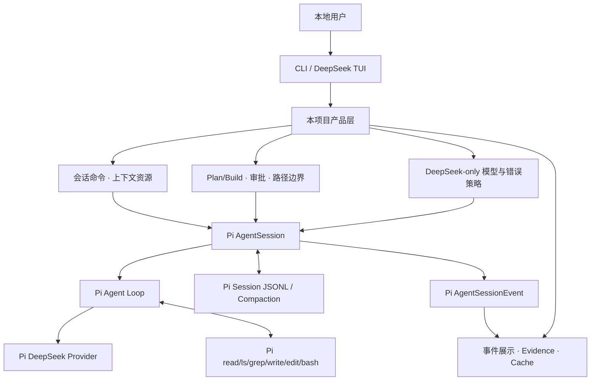

# DeepSeek Coding Agent 当前能力与产品演进方案

> 文档性质：当前产品事实、体验判断与下一阶段实施顺序的主入口
> 最近核对：2026-07-16
> 项目提交基线：`b0750de88279df16db908c9261bbd9160da5fb6c`
> Pi 本地研究基线：`dcfe36c79702ec240b146c45f167ab75ecddd205`
> Pi 上游观察点：`5220aba6`，相对本地研究基线前进 13 个提交，但未合并到本地
> 当前项目依赖：`@earendil-works/pi-coding-agent@0.80.7`、`@earendil-works/pi-tui@0.80.7`
> DeepSeek 官方资料核对：2026-07-16

## 1. 产品判断

这个项目已经跨过“Agent Demo”阶段：它能够选择 DeepSeek、进入真实 Agent Loop、读写代码、执行命令、处理中断和错误、保存会话，并在 TUI 中解释发生了什么。

它目前更准确的成熟度是：

> **功能完整的本地可用原型，但还不是低摩擦、可放心长期使用的日常工具。**

下一阶段的目标不是追求更多功能，而是让以下闭环足够顺畅：

```text
进入仓库
  → 确认环境、模型、上下文和权限
  → 快速引用文件、输入任务
  → 观察模型与工具进度
  → 审批修改或命令
  → 查看本轮 diff
  → 运行验证
  → 必要时撤销本轮文件修改
  → 保存或恢复会话
```

产品定位固定为：

- 本地优先、单用户、DeepSeek 专属。
- 用于自己的真实开发任务、Pi 架构学习和面试演示。
- GitHub 用于保存代码和设计演进，不以 npm 发布、商业化或团队平台为目标。
- Claude Code、Codex CLI、OpenCode 只作为产品设计参考，不做适配器、包装层或排行榜。
- Pi 负责通用 Agent Runtime，本项目负责 DeepSeek 策略、安全边界和交互体验。

## 2. 事实与推断的区分

本文使用两种结论：

- **源码确认事实**：当前代码、测试、安装后的 SDK 类型或本地 Pi 源码能够直接证明。
- **产品设计推断**：基于现状和参考产品作出的优先级判断，需要通过后续使用数据验证。

外部协议只采用官方资料：

- DeepSeek [Models & Pricing](https://api-docs.deepseek.com/quick_start/pricing)
- DeepSeek [Thinking Mode](https://api-docs.deepseek.com/guides/thinking_mode)
- DeepSeek [Tool Calls](https://api-docs.deepseek.com/guides/tool_calls)
- DeepSeek [Context Caching](https://api-docs.deepseek.com/guides/kv_cache/)
- Claude Code [CLI reference](https://docs.anthropic.com/en/docs/claude-code/cli-usage)
- Claude Code [Checkpointing](https://code.claude.com/docs/en/checkpointing)
- Claude Code [Hooks reference](https://code.claude.com/docs/en/hooks)
- Codex CLI [features](https://developers.openai.com/codex/cli/features)
- OpenCode [Tools](https://opencode.ai/docs/tools/)
- OpenCode [Permissions](https://opencode.ai/docs/permissions/)

## 3. 当前架构收敛



### 3.1 Pi 继续负责

- DeepSeek 请求格式、流式解析、reasoning 回放和 usage 归一化。
- Agent Loop、Tool Result 回填、取消和自动重试。
- read/ls/grep/write/edit/bash 的底层执行。
- Session JSONL、消息树、Compaction 和资源加载。
- TUI 差分渲染、Editor、Autocomplete 和选择器组件。

### 3.2 本项目继续负责

- 只允许 DeepSeek，显式模型和 thinking 策略。
- 工具权限、审批、敏感路径、工作区边界和产品提示。
- TUI 信息层级、快捷操作、错误恢复和本轮完成证据。
- 项目上下文的可见性、信任入口和本地设置。
- 本轮 diff、撤销、验证闭环以及本项目自己的评测。

### 3.3 不应重复实现

- 自建 DeepSeek HTTP Provider 或流式 Tool Call assembler。
- 自建 Agent Loop、Session 格式或 Compaction 协议。
- 复制 Pi 完整 InteractiveMode。
- 在没有真实失败样本前增加模糊的 Tool Call 自动修复。

## 4. 已有能力盘点

| 能力域 | 已实现事实 | 关键源码 / 测试 | 当前成熟度 |
|---|---|---|---|
| 模型与认证 | 默认 Flash，只允许 DeepSeek；模型存在性、可用性和凭据预检；恢复会话仍拒绝其他 Provider | `src/cli.ts:159` `resolveDeepSeekModel()`；`src/main.ts:80` `resolveSessionModel()`；`test/cli.test.ts` | 稳定 |
| 一次性 CLI | 支持任务、模型、thinking、审批、Plan/Build、会话选择、ephemeral 和 metrics | `src/cli.ts:44` `parseCliArgs()`；`src/main.ts:266` `runCli()` | 稳定 |
| 事件输出 | text、thinking、tool、retry、error、complete 分通道输出并脱敏 | `src/cli.ts:193` `formatAgentEvent()`；`test/cli.test.ts` | 稳定 |
| Agent Loop | 直接通过 Pi `createAgentSession()`，不复制循环 | `src/main.ts:122` `productionDependencies()`；`src/main.ts:158` | 稳定，依赖 Pi |
| 仓库探索 | read、ls、grep；受 cwd、realpath、symlink 和敏感路径保护 | `src/tool-policy.ts:96`、`:233`；`test/tool-policy.test.ts` | 可用；缺 find 依赖诊断 |
| 修改与命令 | write/edit/bash 默认询问；diff 预览；危险命令阻断；Bash 可按完全相同命令在进程内授权 | `src/tool-policy.ts:134`、`:147`、`:197`、`:239` | 可用；缺本轮撤销 |
| Plan/Build | Plan 从模型可见工具中移除修改工具，策略层仍二次阻断；Build 继续受审批控制 | `src/tool-policy.ts:233`；`src/main.ts:227` | 稳定 |
| 交互 TUI | 多轮、Markdown、折叠 thinking、工具卡、审批、steering、取消、恢复卡和状态栏 | `src/interactive.ts:279` `InteractiveMode`；`:837` `handleEvent()`；`test/interactive.test.ts` | 可用；导航效率不足 |
| 上下文资源 | 展示 AGENTS、Skills、Prompts、System Prompt 大小；可临时过滤项目资源并 reload | `src/context-resources.ts:61`、`:92`；`test/context-resources.test.ts` | 稳定；缺启动信任选择 |
| 持久会话 | create/continue/resume/list/name/tree/fork/clone/compact；限制当前 cwd | `src/sessions.ts:78`、`:130`；`test/sessions.test.ts` | 机制完整；交互入口粗糙 |
| Completion Evidence | 记录修改、diff 查看、识别出的验证命令和未解决错误，不偷偷追加模型请求 | `src/completion-evidence.ts:77`；`test/completion-evidence.test.ts` | 观察型可用；未形成闭环 |
| Cache Inspector | 本轮和 Session hit/miss/rate，足量样本下降告警 | `src/cache-inspector.ts:42`；`test/cache-inspector.test.ts` | 观测可用 |
| 错误恢复 | DeepSeek 官方错误分类；Pi retry 事件可视化；Ctrl+C abort | `src/deepseek-errors.ts:71`；`src/interactive.ts:837` | 可用 |
| 评测 | 7 个协议/repair 任务、隐藏测试反馈、成本边界、按任务聚合 | `src/eval.ts:101`、`:587`；`src/eval-report.ts:70`；`test/evaluation.test.ts` | 基线可用；任务仍偏小 |

当前自动化共 56 项，覆盖纯函数、替身 Session、临时目录工具、80×24 TUI、SessionManager 和评测汇总。真实 API 只用于受控 smoke。

## 5. 当前真实可用路径

### 5.1 已经适合使用

- 只读理解仓库和制定修改方案。
- 中小型 TypeScript/JavaScript bug 定位与受控修改。
- 明确批准的 Bash 检查、构建和测试。
- 多轮追问、短期 steering、Provider 错误恢复。
- 保存会话并在同一工作区恢复。
- 检查当前模型、上下文资源、缓存和完成证据。

### 5.2 仍然会造成日常摩擦

1. **启动缺少集中诊断**：Node、Git、rg、可选 fd、API 凭据、模型、终端能力和工作区状态分散在不同错误里。
2. **输入发现性较弱**：已经有很多 slash command，但 Editor 没接命令和文件自动补全。
3. **Session 能恢复但难选择**：有 `/sessions` 文本列表和 ID 恢复，没有交互选择器。
4. **能预览修改但不能可靠撤销本轮修改**：用户拒绝前安全，批准后主要依赖 Git 手工恢复。
5. **Evidence 只提醒，不帮助完成下一步**：发现“改了但未验证”后，仍需用户自己重新输入指令。
6. **工具卡信息层级不足**：长 Bash、长参数和长结果缺少折叠/展开与更清晰的退出状态。
7. **本地偏好不可配置**：模型、thinking、mode、approval、项目资源等每次依赖 CLI 参数或当前进程状态。
8. **项目资源没有完整的启动信任体验**：第三方 Extension 已禁用，但项目 AGENTS/Skills/Prompts 仍应在首次进入陌生仓库时更明确地展示来源。
9. **真实任务评测仍小**：当前 fixture 能验证机制，不能充分代表跨模块重构、长日志和复杂测试修复。

## 6. 外部产品带来的设计启发

这些结论只用于本项目功能取舍。

### 6.1 DeepSeek

- V4 Flash/Pro 当前都支持 thinking、工具调用和 1M context；因此近期瓶颈不是“是否能调用工具”，而是 Harness 如何控制上下文、工具和验证。
- thinking 的有效 effort 是 `high/max`，temperature/top_p 在 thinking 模式无效；本项目继续保持显式档位，不增加无效旋钮。
- 工具轮次中的 reasoning 必须正确回传；该职责继续交给 Pi Provider，本项目用真实多轮工具任务做回归。
- Context Cache 默认工作且要求稳定重复前缀；System Prompt、工具集合和资源顺序不应为装饰性信息频繁变化。

### 6.2 Claude Code

- Checkpointing 的核心价值不是“又一个 Git”，而是用户可以分别恢复代码和对话；同时官方明确 Bash 和外部修改不在文件检查点能力内。
- PreToolUse/PostToolUse 的价值是把权限、输入转换、结果裁剪和验证反馈放在明确生命周期边界。本项目已有 Pi tool hook，应继续扩展产品策略，而不是自建循环。

### 6.3 Codex CLI

- resume、图像/文件上下文、非交互输出和本地审批组成一条可组合工作流。
- 对本项目最值得借鉴的是“命令入口清晰、状态可恢复、默认受限”，不是照搬命令名称或支持其他 Provider。

### 6.4 OpenCode

- 工具权限采用 allow/ask/deny，编辑、Bash、外部目录等分开表达；本项目当前的 Plan/Build + approval 已覆盖核心思想。
- `patch`、LSP、todo 等能力很容易增加功能数量，但不应在 edit/grep/bash 主链尚未充分量化前全部加入。

## 7. 产品设计原则

后续功能必须同时满足：

1. **日用价值优先**：减少一次真实任务中的等待、重复输入或不确定性。
2. **复用 Pi 优先**：先检查 SDK 类型和 Pi 源码，再决定是否写产品层代码。
3. **显式成本**：不自动从 Flash 升级 Pro，不隐藏增加模型轮次。
4. **可逆优先**：修改能力增强时，同时设计 diff、撤销和冲突保护。
5. **事实型 UI**：只展示真实事件、真实文件状态和真实 usage，不猜模型内部状态。
6. **单 Agent 闭环优先**：搜索、修改、验证、恢复稳定前不做多 Agent。
7. **安全边界准确**：审批不是沙箱，文件 checkpoint 也不是 Git 替代品。
8. **小步验收**：每次只解决一个可观测摩擦点，保留回滚条件。

## 8. 分阶段迭代路线

### P0-A：运行基线与 Doctor

目标：进入任何本地仓库时，先知道“能不能安全、稳定地运行”。

功能：

- `--doctor` 或 `doctor` 子命令，完全不调用模型。
- 检查 Node 版本、Git 仓库、工作树状态、rg、可选 fd、终端 TTY/颜色、Session 目录可写性。
- 只判断 DeepSeek 凭据是否存在，不显示值；验证默认模型是否在当前 catalog 且可用。
- 展示当前 SDK、Pi 研究基线、cwd、默认 mode/approval 和项目资源数量。
- 将 find 标记为“可选能力”：fd 可用才加入工具集合，否则给出一次性安装提示，不在运行中突然失败。
- 建立 Pi 升级门：新发布版先做类型/事件/模型目录 diff，再升级精确依赖。

验收：

- 离线、缺 Key、缺 Git、缺 rg/fd、非 TTY 都有确定性测试。
- Doctor 不读取或打印密钥，不创建 Session，不调用 API。
- Pi 当前上游 model runtime 重构未发布前，不让产品代码依赖 `main` 的新 API。

### P0-B：TUI 导航与输入效率

目标：减少记命令、复制路径和手输 Session ID 的摩擦。

功能：

- 接入 `pi-tui` `CombinedAutocompleteProvider`。
- `/` 自动补全本项目命令、Skill 和 Prompt Template。
- `@` 或 Tab 文件补全只在当前工作区内，继续遵守敏感路径策略。
- `/resume` 或启动 `--resume` 无参数时使用 Pi `SessionSelectorComponent`。
- `/tree` 使用 Pi `TreeSelectorComponent`，保留文本命令作为脚本入口。
- `/model` 使用 DeepSeek-only 选择器；非 DeepSeek 模型不进入候选列表。
- 工具卡默认显示摘要，可展开完整的已脱敏参数和截断结果。

验收：

- 80×24 和 120×40 两种终端下不会遮挡输入区。
- 自动补全不扫描工作区外路径，不显示敏感文件。
- 选择器取消后不改变当前 Session/模型/消息树。

### P0-C：本轮 Diff 与安全撤销

目标：用户敢于批准修改，因为能够清楚查看并可靠撤销本轮文件操作。

最小设计：

- 在 write/edit 执行前记录受影响文件的 pre-image；执行后记录 post-image 和工具调用 ID。
- 每个用户 prompt 形成一个本轮文件 checkpoint。
- `/diff` 展示本轮聚合 diff，优先复用 Pi 导出的 `renderDiff`。
- `/undo` 只恢复本轮由 write/edit 改动的文件。
- 撤销前校验磁盘当前内容仍等于记录的 post-image；如果用户或其他进程已再次修改，拒绝覆盖并展示冲突文件。
- 新文件撤销为删除，原文件撤销为恢复；只处理工作区内普通文件和经过现有策略批准的路径。
- Bash、副作用命令、包安装、数据库和工作区外变化明确不在撤销范围内。
- checkpoint 跟随 Session 保存，但不把完整敏感内容写入普通日志；文件快照目录加入生命周期清理。

验收：

- 单文件、多文件、新文件、连续两轮、resume 后撤销、外部冲突都有测试。
- `/undo` 绝不调用 `git reset/checkout/clean`，不覆盖 checkpoint 之后的外部修改。
- TUI 始终准确说明“文件撤销”而非“完整任务回滚”。

### P0-D：验证驱动的完成闭环

目标：减少“代码改了，但没看 diff、没跑测试就结束”。

功能：

- 保留当前 Completion Evidence，不立即改成强制自动续跑。
- settled 后如果发生源码修改但没有 diff 或验证，提供明确操作：`v` 让 Agent 继续验证、`d` 查看本轮 diff、`u` 撤销、Enter 接受现状。
- `v` 必须是用户显式触发的新模型轮次，并在提交前显示将继续产生费用。
- 增加项目验证建议发现：只读取 package.json、pyproject.toml、Cargo.toml 等已知入口，不自动执行。
- 对已批准的常见安全检查支持当前进程精确授权，继续拒绝通配符放行。
- 失败验证结果以短摘要回填模型，原始长日志保留在本地临时文件并提供路径，不整段塞回上下文。

验收：

- 修改未验证、验证失败、验证通过、用户跳过四条路径都有 TUI 测试。
- 不因 Evidence 自动增加请求或自动执行未知命令。
- 长测试日志不会淹没 TUI 或模型上下文。

### P1-A：本地设置与项目信任

目标：减少重复配置，同时让陌生项目上下文来源可控。

功能：

- 用户级设置保存默认模型、thinking、mode、approval、reasoning 展示和 TUI 偏好。
- 项目级设置只保存非敏感选项和建议验证命令，不保存 API Key。
- 首次进入包含项目 AGENTS/Skills/Prompts 的陌生目录时，展示来源并允许本次启用、记住启用或禁用。
- 复用 Pi `ProjectTrustStore`/trust 组件；项目资源信任继续不等于工具批准。
- 设置文件损坏时显示错误并回退安全默认值，不静默覆盖。

### P1-B：Bash 与工具结果体验

目标：让长命令可观察、可取消、可回看。

功能：

- 工具卡展示 cwd、持续时间、退出码、是否截断和取消状态。
- 长输出分为 tail 摘要与可展开详情；模型只接收 Pi 已裁剪的结果。
- 明确区分命令超时、用户取消、非零退出和 Provider 中断。
- 评估复用 Pi `BashExecutionComponent`，不重新实现 PTY 管理。

### P1-C：DeepSeek Prompt 与显式工作档位

目标：通过数据改善任务完成率，而不是增加隐藏智能。

候选实验：

- 固定、短小的 DeepSeek Coding System Prompt。
- 强调 inspect → edit → diff → validate → report，但避免长规则堆叠。
- 保持工具顺序和 Schema 稳定，量化 cache hit。
- 仅在评测证实后提供显式预设，例如 Flash/high、Flash/max、Pro/max；切换 Pro 必须明确确认成本变化。
- 不做基于模糊“复杂度评分”的自动模型路由。

### P2：增强能力

只有 P0/P1 稳定后再评估：

- TypeScript/Python 只读 diagnostics，先调用现有编译器，再考虑 LSP。
- 可配置的本地 post-edit hook，用于格式化或轻量检查；默认关闭并受项目信任控制。
- apply_patch 工具，仅在收集到 edit 无法可靠表达的失败样本后评估。
- 容器化执行 profile，用于需要强隔离的演示任务；不把它与普通审批混为一谈。
- 项目长期记忆，必须先解决陈旧信息、来源展示和前缀缓存影响。

## 9. 明确不进入近期范围

- 其他 Agent 适配器或对比排行榜。
- MCP、多 Agent、子 Agent 编排。
- IDE 插件、Web UI、云端服务和远程任务。
- 自动提交、自动推送、自动创建 PR。
- 默认联网搜索工具。
- 自建 DeepSeek Provider。
- 完整企业权限系统。
- 在没有隔离后端时宣称拥有沙箱。

## 10. 质量指标

不以功能数量衡量产品，后续记录以下指标：

| 指标 | 目的 | 初期采集方式 |
|---|---|---|
| 真实任务完成率 | 是否真正解决问题 | 本项目 fixture + 自己仓库的脱敏任务记录 |
| 修改后验证率 | 是否形成闭环 | Completion Evidence |
| 无效工具调用率 | 工具 Schema/提示是否清晰 | AgentSessionEvent |
| 用户审批次数 | 安全与摩擦的平衡 | 只记工具类别和决策，不记敏感参数 |
| 撤销成功/冲突率 | checkpoint 是否可靠 | 本地 checkpoint 事件 |
| Session 恢复成功率 | 长任务是否可继续 | resume smoke 与自动化 |
| 首响应/总耗时 | 交互是否流畅 | EvaluationMetrics |
| Cache hit/miss | 前缀是否稳定 | Cache Inspector |
| 单个成功任务成本 | 优化是否值得 | Pi SessionStats |
| 用户主动中断率 | 是否卡住或输出失控 | abort 事件 |

本地个人项目不需要遥测服务器。指标只保存在明确忽略的本地评测产物中，默认不提交 Git。

## 11. 接下来四个可直接开工的迭代

### Iteration 1：Doctor 与 Pi 兼容门

预计修改：`src/doctor.ts`、`src/cli.ts`、`src/main.ts`、对应测试和文档。

成功标准：不调用 API 即可一次说明当前环境是否能运行；明确 fd/find 降级；记录 Pi `0.80.7` 到下一发布版的兼容风险。

### Iteration 2：命令/文件补全与 Session Selector

预计修改：`src/interactive.ts`，必要时增加 `src/autocomplete.ts`；复用 Pi TUI/selector 导出。

成功标准：用户无需记住大多数 slash command 和 Session ID；80×24 自动化通过；敏感路径不进入候选。

### Iteration 3：本轮 Diff 与文件 Undo

预计修改：新增 `src/checkpoints.ts`，在 Tool Policy hook 和 TUI 命令接入；增加临时目录集成测试。

成功标准：write/edit 多文件任务可查看聚合 diff并安全撤销；检测外部冲突；不使用破坏性 Git 命令。

### Iteration 4：显式验证闭环

预计修改：扩展 `src/completion-evidence.ts` 和 TUI settled 操作，不改变 Pi Agent Loop。

成功标准：未验证修改会提供清晰的 diff/verify/undo 选择；只有用户选择 verify 才增加请求；长错误反馈保持脱敏和有界。

## 12. 每次迭代的完成门槛

1. 从安装后的 SDK 类型和对应 Pi 源码确认 API。
2. 先写失败/边界测试，再实现最小功能。
3. `npm run check`、`npm run build`、`npm test` 全部通过。
4. TUI 变化覆盖至少 80×24；文件变化使用临时 Git 仓库。
5. 自动化不调用真实 API；必要时只做一次低成本 smoke。
6. 更新本文“当前能力”和下一迭代状态。
7. 不提交 `.env`、Session JSONL、checkpoint 内容或真实评测日志。

## 13. 最终产品完成标准

当以下条件同时成立，可以把它视为真正适合本地长期使用的个人 Coding Agent：

- 新仓库启动时能一次完成环境和上下文诊断。
- 常用命令、文件和会话可以选择，不依赖记 ID 或复制路径。
- 修改前能审批，修改后能看 diff，误修改能安全撤销。
- 代码修改默认走验证闭环，失败信息足够模型继续修复。
- 长任务能取消、恢复和压缩，不丢失当前工作目标。
- DeepSeek 的 thinking、工具、缓存和成本都有可解释数据。
- 安全限制写得准确，不把审批、checkpoint 或 Git 说成沙箱。
- 项目代码和文档能清楚解释 Pi 与产品层各自负责什么。
