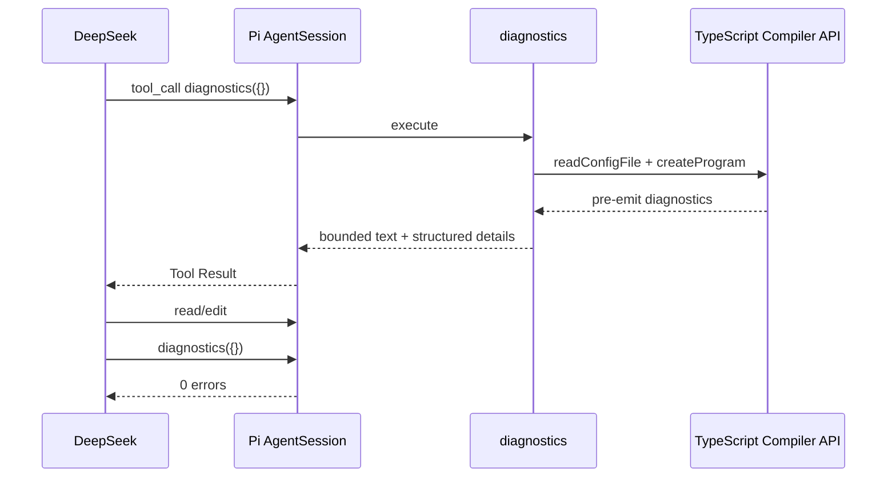

# 只读 TypeScript Diagnostics 设计

> 实现日期：2026-07-16
> Pi SDK：`@earendil-works/pi-coding-agent@0.80.7`
> Pi 研究基线：`dcfe36c79702ec240b146c45f167ab75ecddd205`

## 1. 为什么不继续加长 DeepSeek Profile

两轮 Profile A/B 的 36 个逻辑样本全部通过，成功率已经触顶。DeepSeek Profile 虽然在高区分度任务中把工具调用从 73 降到 69、工具错误从 4 降到 2，但总体耗时高 10.8%、成本高 4.9%，没有形成质量收益。

Pi 当前 System Prompt 还会根据活动工具动态加入精确规则。例如 read 明确要求使用 offset/limit，edit 明确要求 oldText 唯一、多个不相邻修改合并为一次调用，write 只用于新文件或完整重写。继续追加“先读、再改、再验证”的通用规则，主要改变模型行为偏好，并没有增加新的定位证据。

因此本迭代把优化点从 Prompt 转到 Harness：为模型提供编译器确认的文件、行列、错误码和消息。

## 2. 能力边界

`diagnostics` 是本项目注册的只读工具：

- 只处理工作区根目录的 `tsconfig.json`。
- 使用产品依赖的固定 TypeScript `5.9.3` Compiler API。
- 不调用 shell、项目脚本或项目 `node_modules/.bin/tsc`。
- 只调用 `getPreEmitDiagnostics()`，不生成 JavaScript、声明文件或 `.tsbuildinfo`。
- 只返回工作区内的文件诊断；单条消息最多 600 字符，总数最多 80 条。
- 在 Plan 和 Build 中均可见；`deny` 模式仍不暴露任何工具。
- 当前编译过程是同步的，执行前后响应取消，但不能在 TypeScript 编译中途抢占。

这不是 LSP：没有增量索引、跳转定义、引用查找、单文件增量刷新，也不支持 Python。第一版先验证“结构化编译错误是否比继续调 Prompt 更有价值”。

## 3. 调用链

`src/main.ts` 通过 Inline Extension 注册工具；`src/tool-policy.ts` 把它加入只读工具集合。工具执行、Tool Result 回填和事件仍由 Pi 负责。

## 4. 真实验证

新增 `repair-typescript-diagnostics` 任务：fixture 含一个 TS2322 错误、一个受保护消费者文件和受保护 `tsconfig.json`。评分要求：

- 必须调用 `diagnostics`；
- 只修改报告定位的 `src/registry.ts`；
- 修改后编译诊断为零；
- 不创建额外文件；
- 工具和 Provider 无错误。

Flash/high + Pi Profile 最终受控验证通过：工具序列为 `diagnostics → read → edit → diagnostics`，总耗时 9.857 秒，成本 `$0.0004695712`，4 次工具调用、0 工具错误、0 Provider 错误，cache hit rate 93.81%。

该结果证明真实闭环可用，不证明总体任务成功率已经提高。下一步需要在更多 TypeScript 任务上重复，并加入“无 diagnostics”控制组；只有重复结果改善完成率或显著减少搜索/错误调用时，才作质量提升结论。

## 5. 后续迭代

1. 增加显式配置路径，但必须保持工作区/realpath 边界。
2. 将同步编译移到可取消 worker，避免大型项目阻塞 TUI。
3. 收集 monorepo、多 tsconfig、project references 的真实失败样本。
4. TypeScript 路径稳定后，再用同一只读、安全边界实现 Python diagnostics。
5. 只有编译器模式无法满足语义导航时，才评估 LSP 常驻进程。
