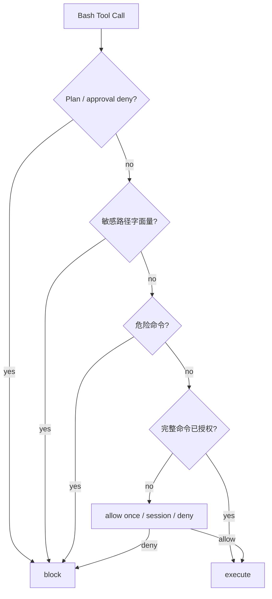

# 进程内精确 Bash 授权

> 最近验证：2026-07-16
> 实现位置：`src/tool-policy.ts`、`src/interactive.ts`

## 1. 目标

减少同一安全命令在长工具循环中反复询问，同时避免通配符授权把语义不同的命令一起放行。

## 2. 三种审批结果

| 结果 | TUI 输入 | 行为 |
|---|---|---|
| `allow-once` | `y` / `yes` | 只允许当前 Tool Call |
| `allow-session` | Bash 中 `a` / `always` | 当前进程内允许完全相同的 command 字符串 |
| `deny` | 其他输入或 Ctrl+C | 阻断并将原因作为 Tool Result 回填模型 |

write/edit 不提供 `allow-session`，仍逐次显示 diff 并确认。

## 3. 匹配与生命周期

ToolPolicy 用内存 Set 保存 Bash command 原始字符串。只有字节一致的命令命中；追加参数、空格变化、管道或重定向变化都会重新审批。

授权：

- 只存在于当前进程。
- 不写入 Pi JSONL，不随 resume 恢复。
- 不跨 cwd，因为每个 ToolPolicy 固定绑定启动工作区。
- 切到 Plan 后暂时不可执行 Bash；切回 Build 时同进程授权仍存在。

## 4. 安全顺序

安全检查先于授权 Set，因此先前允许的字符串不会绕过后来同一次执行中的危险/敏感判断。当前没有通配符、前缀、正则或“此工具永久允许”。

## 5. 验证

自动化覆盖：

- TUI `y` 返回 allow-once，`a` 返回 allow-session。
- 首次 Session 授权后相同命令不再调用审批回调。
- 命令增加参数后重新审批。
- 敏感路径和危险命令在审批前阻断。
- evaluator 仍只对临时目录 write/edit 返回 allow-once，Bash 保持拒绝。

真实 `deepseek-v4-flash` 非 TTY Smoke 验证了新审批结果的安全退化：`bash pwd` 收到拒绝 Tool Result，Agent 正常完成，输出无 key 形态且工作区不变。进程内精确复用由确定性 ToolPolicy 与 80×24 TUI 测试覆盖。
