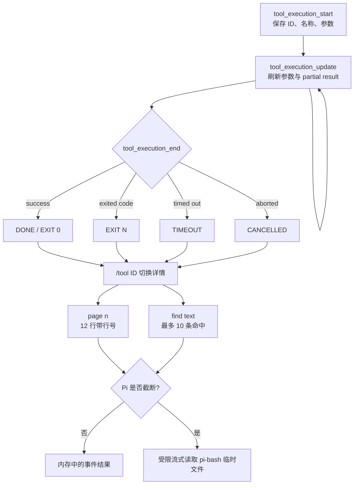

# Bash 与工具结果卡

> 实现日期：2026-07-16
>
> Pi 源码基线：`dcfe36c79702ec240b146c45f167ab75ecddd205`
>
> 产品边界：只实现展示与交互，不复制 Pi 的工具执行器

## 1. 目标

长时间 Coding Agent 任务需要让用户快速回答五个问题：正在执行什么、执行到哪里、为何失败、完整结果在哪里、怎样在长结果中定位目标。此前 TUI 在 `tool_execution_update` 时把 `partialResult` 当成参数显示，流式 Bash 会把原始命令覆盖成结果对象；结束后又只保留短摘要，退出码和截断边界不清晰。

本轮把工具展示收敛为一个宽度感知的状态卡：

```text
╭─ BASH · EXIT 0
│ $ npm run check
│ cwd=. · duration=1.2s
│ ...latest output
│ truncated=lines · full=/tmp/pi-bash-...
╰─ /tool abc123 to expand · id=abc123

╭─ TOOL OUTPUT · BASH · abc123
│ page=2/8 · lines=96 · source=Pi temp file
│ 13 │ first visible line
│ ...
│ 24 │ last visible line
╰─ /tool abc123 page <n> · /tool abc123 find <text>
```

## 2. 事实边界

源码确认：

- Pi `AgentSessionEvent` 提供 `tool_execution_start`、`tool_execution_update`、`tool_execution_end`；update 同时包含原始 `args` 与 `partialResult`（`packages/agent/src/types.ts:428-430`）。
- Pi Bash 结果的 `BashToolDetails` 提供可选 `truncation` 和 `fullOutputPath`（`packages/coding-agent/src/core/tools/bash.ts:47-50`）。
- Pi Bash 的成功、非零退出、超时与取消分别以正常结果、`Command exited with code N`、`Command timed out after N seconds`、`Command aborted` 表达。
- Pi `OutputAccumulator` 和 truncation 工具负责 2000 行/50KB 默认裁剪；发生裁剪时 Bash 工具负责写入本机 `pi-bash` 临时完整输出（`packages/coding-agent/src/core/tools/truncate.ts:4-12`、`packages/coding-agent/src/core/tools/bash.ts:313`、`:375-390`）。

对应上游位置：

- `packages/agent/src/types.ts`：`AgentEvent` 工具事件联合类型。
- `packages/coding-agent/src/core/tools/bash.ts`：`BashToolDetails`、`createBashTool()`。
- `packages/coding-agent/src/core/tools/output-accumulator.ts`：`OutputAccumulator`。
- `packages/coding-agent/src/core/tools/truncate.ts`：`TruncationResult` 与默认限制。

设计推断：产品不需要复用 Pi 完整 `ToolExecutionComponent`。该组件绑定 Pi 自身 theme、工具定义和交互模式；本项目只需要消费稳定事件和 details，在保持原创 DeepSeek 视觉层级的同时避免引入第二套 Runtime。

## 3. 状态与数据流



`ToolActivityCard` 在 start 时保存 `toolCallId`、tool name 和 args；update 分别读取事件的 args、partial output 与 details；end 决定稳定终态。这样流式结果不会被序列化成命令参数。若测试替身或异常链只发 end，TUI 会创建缺省 args 的卡片，仍保留错误可见性。产品实现位于 `src/interactive.ts` 的 `ToolOutputViewCard`、`ToolActivityCard`、`handleToolCommand()` 与 `handleSessionEvent()`，受限文件读取位于 `src/tool-output.ts` 的 `openPiBashOutput()`、`readToolOutputPage()` 和 `searchToolOutput()`。

## 4. 信息层级

- 折叠态：最多两行参数、两行结果 tail。
- 展开态：最多八行参数、十六行结果 tail。
- 结果更多时显示省略的 earlier lines 数量。
- Bash 显示当前产品工作目录和真实持续时间。
- 截断时显示 Pi `truncatedBy` 与 `fullOutputPath`；分页每次只保留 12 行，搜索最多保留 10 条命中，不把完整文件一次性载入内存。
- `/tool` 切换最近一张卡；`/tool <唯一 ID 前缀>` 定位历史卡；无匹配或前缀歧义明确报错。
- `/tool page [n]`、`/tool <id> page [n]` 查看最近或指定结果；页码必须为正整数。
- `/tool find <text>`、`/tool <id> find <text>` 做大小写不敏感的普通子串搜索；查询限制为单行 100 字符。

`src/tool-output.ts` 负责受限读取。未截断结果使用当前进程保存的事件文本；被 Pi 截断的 Bash 仅接受系统临时目录直属的 `pi-bash-[16位十六进制].log` 普通文件。读取前拒绝 symlink，使用 `O_NOFOLLOW` 打开文件句柄后再检查类型和 100 MiB 上限。路径无效、文件已被系统清理、页码越界或工具仍在运行时都明确失败，不静默退回可能不完整的 tail。

查看只允许在 Agent 与 Compaction 空闲时启动，避免 Ctrl+C 与模型/工具取消产生歧义。分页或搜索期间状态栏展示真实阶段；Ctrl+C 通过独立 AbortSignal 停止本地读取，关闭文件句柄并回到可继续输入的 Session，不影响模型历史。

卡片和分页/搜索结果统一调用 `sanitizeError()` 处理命令、参数和输出。读取到的 API Key、Bearer token 或已知敏感值不会写入 transcript。搜索只影响本地展示，不调用模型、不执行工具，也不写入 Session JSONL。

## 5. 不做的事情

- 不复制 Pi PTY、子进程、超时和 AbortSignal 处理。
- 不重新裁剪模型收到的 Tool Result。
- 不建立日志索引、正则表达式引擎或全屏编辑器；分页是显式页码，搜索是普通子串。
- 不让 `/tool` 触发模型请求或工具执行。
- 不把临时完整输出文件写入 Session 或 Git。
- 不保证 Pi 临时日志跨进程、系统清理或重启后仍存在；历史 Session 恢复不会重建旧 ToolActivityCard。

## 6. 验证

`test/interactive.test.ts` 在固定 80×24 终端中覆盖：

- start → update 保留 `$ command`，不显示 `{"content": ...}` 参数替代物。
- 成功 `EXIT 0`、非零退出、超时和取消。
- 两行折叠 tail、十六行展开 tail 和再次折叠。
- Pi truncation metadata 与完整输出路径。
- `/tool` 最近卡和 ID 前缀定位。
- inline 结果分页、页码越界、大小写不敏感搜索和 10 条命中上限。
- 真实 `pi-bash-*.log` 流式分页/搜索、非临时目录拒绝、symlink 拒绝和敏感值遮蔽。
- 预先取消的 AbortSignal 不返回部分搜索结果。
- 80×24 分页与 100×30 搜索卡片。

自动化使用 Session 替身，不调用真实 DeepSeek API。
