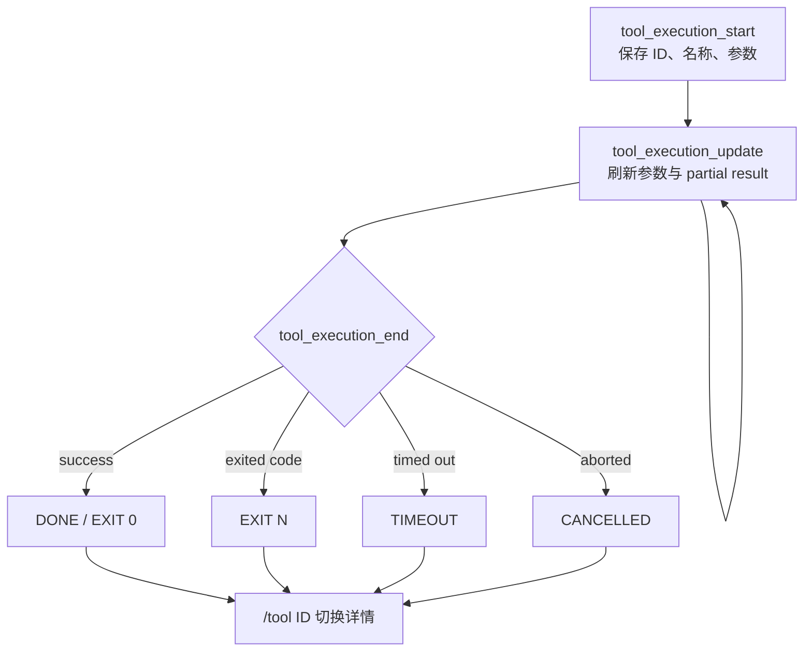

# Bash 与工具结果卡

> 实现日期：2026-07-16
>
> Pi 源码基线：`dcfe36c79702ec240b146c45f167ab75ecddd205`
>
> 产品边界：只实现展示与交互，不复制 Pi 的工具执行器

## 1. 目标

长时间 Coding Agent 任务需要让用户快速回答四个问题：正在执行什么、执行到哪里、为何失败、完整结果在哪里。此前 TUI 在 `tool_execution_update` 时把 `partialResult` 当成参数显示，流式 Bash 会把原始命令覆盖成结果对象；结束后又只保留短摘要，退出码和截断边界不清晰。

本轮把工具展示收敛为一个宽度感知的状态卡：

```text
╭─ BASH · EXIT 0
│ $ npm run check
│ cwd=. · duration=1.2s
│ ...latest output
│ truncated=lines · full=/tmp/pi-bash-...
╰─ /tool abc123 to expand · id=abc123
```

## 2. 事实边界

源码确认：

- Pi `AgentSessionEvent` 提供 `tool_execution_start`、`tool_execution_update`、`tool_execution_end`；update 同时包含原始 `args` 与 `partialResult`（`packages/agent/src/types.ts:428-430`）。
- Pi Bash 结果的 `BashToolDetails` 提供可选 `truncation` 和 `fullOutputPath`（`packages/coding-agent/src/core/tools/bash.ts:47-50`）。
- Pi Bash 的成功、非零退出、超时与取消分别以正常结果、`Command exited with code N`、`Command timed out after N seconds`、`Command aborted` 表达。
- Pi `OutputAccumulator` 和 truncation 工具负责 2000 行/50KB 默认裁剪；发生裁剪时 Bash 工具负责写入本机 `pi-bash` 临时完整输出（`packages/coding-agent/src/core/tools/truncate.ts:4-12`、`packages/coding-agent/src/core/tools/bash.ts:313`、`:375-390`）。

对应上游位置：

- `packages/agent/src/types.ts`：`AgentEvent` 工具事件联合类型。
- `packages/coding-agent/src/core/tools/bash.ts`：`BashToolDetails`、`createBashTool()`。
- `packages/coding-agent/src/core/tools/output-accumulator.ts`：`OutputAccumulator`。
- `packages/coding-agent/src/core/tools/truncate.ts`：`TruncationResult` 与默认限制。

设计推断：产品不需要复用 Pi 完整 `ToolExecutionComponent`。该组件绑定 Pi 自身 theme、工具定义和交互模式；本项目只需要消费稳定事件和 details，在保持原创 DeepSeek 视觉层级的同时避免引入第二套 Runtime。

## 3. 状态与数据流



`ToolActivityCard` 在 start 时保存 `toolCallId`、tool name 和 args；update 分别读取事件的 args、partial output 与 details；end 决定稳定终态。这样流式结果不会被序列化成命令参数。若测试替身或异常链只发 end，TUI 会创建缺省 args 的卡片，仍保留错误可见性。产品实现位于 `src/interactive.ts:298-395`、`:1131-1156` 和 `:1277-1296`。

## 4. 信息层级

- 折叠态：最多两行参数、两行结果 tail。
- 展开态：最多八行参数、十六行结果 tail。
- 结果更多时显示省略的 earlier lines 数量。
- Bash 显示当前产品工作目录和真实持续时间。
- 截断时显示 Pi `truncatedBy` 与 `fullOutputPath`，不在 TUI 再读完整文件。
- `/tool` 切换最近一张卡；`/tool <唯一 ID 前缀>` 定位历史卡；无匹配或前缀歧义明确报错。

卡片调用统一的 `sanitizeError()` 处理命令、参数和输出。它不会把 API Key、Bearer token 或已知敏感值写入 transcript。

## 5. 不做的事情

- 不复制 Pi PTY、子进程、超时和 AbortSignal 处理。
- 不重新裁剪模型收到的 Tool Result。
- 不把完整日志加载进 TUI，也不提供结果搜索。
- 不让 `/tool` 触发模型请求或工具执行。
- 不把临时完整输出文件写入 Session 或 Git。

## 6. 验证

`test/interactive.test.ts` 在固定 80×24 终端中覆盖：

- start → update 保留 `$ command`，不显示 `{"content": ...}` 参数替代物。
- 成功 `EXIT 0`、非零退出、超时和取消。
- 两行折叠 tail、十六行展开 tail 和再次折叠。
- Pi truncation metadata 与完整输出路径。
- `/tool` 最近卡和 ID 前缀定位。

自动化使用 Session 替身，不调用真实 DeepSeek API。
