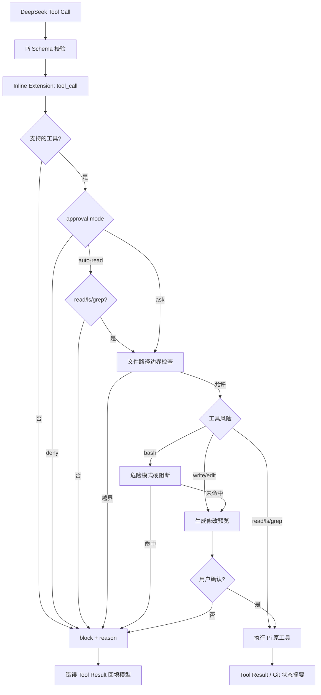

# M2 工具安全设计

> 实现版本：M2
> Pi SDK：`0.80.7`
> 最近验证：2026-07-15

## 1. 目标与边界

M2 的目标是让 Pi 默认工具进入本项目的产品策略层：模型只能看到当前模式允许的工具，文件工具不能越过工作区，高影响操作必须获得用户批准。

这不是沙箱。审批通过后的 Bash 仍以启动进程的本地用户权限运行。真正的 OS 隔离需要容器、VM 或替换 Pi tool operations，当前里程碑不实现。

## 2. 三种模式

| 模式 | 模型可见工具 | 行为 |
|---|---|---|
| `ask` | read/ls/grep/write/edit/bash | read/ls/grep 自动允许；write/edit/bash 逐次确认 |
| `auto-read` | read/ls/grep | 只允许工作区内读取、列目录和内容搜索 |
| `deny` | 无 | 不向模型暴露工具 |

默认模式是 `ask`。非 TTY 环境无法安全交互确认，因此 write/edit/bash 自动拒绝，不会假定同意。

## 3. 调用链



## 4. Pi 接入方式

实现使用 `DefaultResourceLoader.extensionFactories` 注册命名 Inline Extension，在 `tool_call` 事件中返回 `{block, reason}`。AgentSession 会把拒绝转换成错误 Tool Result，模型可以看到原因并调整后续行为。

关键实现：

- `src/tool-policy.ts`：模式、路径、审批、危险命令和 Inline Extension。
- `src/main.ts`：ResourceLoader、终端确认、工具 allowlist 和 Git 状态摘要。
- `src/cli.ts`：`--approval` 参数。

本项目继续使用 Pi 的 read/ls/grep/write/edit/bash 实现，没有复制目录遍历、内容搜索、文件编辑、diff 应用或进程执行逻辑。Pi 的 grep 负责 `.gitignore`、匹配数量、字节和长行截断。

## 5. 文件路径边界

read/ls/grep/write/edit 在审批前执行两层检查；ls/grep 未传 `path` 时以工作区根目录为默认值：

1. 将用户路径解析到启动工作区，阻止 `../` 等词法越界。
2. 对已存在目标或最近存在父目录执行 `realpath`，阻止符号链接把操作导向工作区外。

该检查覆盖：

- 工作区外绝对路径。
- `../` 路径穿越。
- 指向外部文件或目录的 symlink。
- 通过外部 symlink 父目录创建新文件。

它不能消除检查与执行之间发生文件系统替换的 TOCTOU 风险，因此不应被描述为强隔离。

Pi 0.80.7 同时提供 `find`，但默认实现依赖外部 `fd`。2026-07-16 真实 Smoke 中 ls/grep 成功、find 因本机无 `fd` 失败，因此本项目没有把 find 放进默认稳定工具集合。只有完成依赖预检或可靠 fallback 后才重新评估，避免首次仓库探索隐式下载工具。

## 6. 修改预览

- `write`：读取原文件并使用 Pi `generateDiffString()` 展示新旧内容差异；新文件以空内容为基线。
- `edit`：当每个 oldText 在预览内容中唯一命中时展示完整预期 diff；无法精确预览时明确提示由 Pi 在执行阶段校验和解析。
- 预览最多 4000 字符，避免大修改刷满终端。
- Pi 工具执行后的真实 result/details 仍会通过事件输出。

## 7. Bash 策略

Bash 始终属于高风险工具，在 `ask` 模式中显示命令、cwd 和“非沙箱”提示。

以下明显破坏性模式在询问前直接阻断：

- `git reset --hard`
- 带 force 的 `git clean`
- 递归删除根目录
- `mkfs`、shutdown/reboot/halt/poweroff
- `dd ... of=/dev/*`
- curl/wget 直接管道到 shell
- 典型 fork bomb

该列表是最后一道防误操作护栏，不是完整 Shell 安全分析器。审批后的命令可以访问网络、绝对路径和工作区外资源；强边界应在后续使用容器或替换 Bash operations 实现。

## 8. 项目扩展策略

M2 暂时设置 `noExtensions: true`，禁止自动加载用户或项目发现的可执行 Extension，但保留本项目的 Inline Policy Extension。AGENTS.md、Skills 和 Prompt Templates 不受该开关影响。

原因：在项目信任和资源可见性 UI 尚未完成前，自动执行第三方 Extension 会绕开“默认安全”的产品承诺。M4 实现信任与资源展示后再评估开放方式。

## 9. Git 摘要

当 write/edit/bash 成功结束时，任务完成后执行无 Shell 的：

```text
git -C <workspace> status --short
```

只展示工作区状态，不自动 stage、commit 或 push。非 Git 目录显示 unavailable。

## 10. 验证记录

当前自动化测试共 49 个，其中工具策略覆盖：

- 三种模式和 read/ls/grep/write/edit/bash allowlist。
- 工作区内读取/列目录/内容搜索、`../` 越界与 symlink 逃逸。
- 使用真实 Pi ls/grep Tool 执行确定性临时目录发现任务。
- write/edit diff 预览和批准/拒绝。
- 危险 Bash 硬阻断。
- Inline Extension 将拒绝转换为 Pi tool-call block。
- 审批通过后实际执行 Pi write 工具并验证文件内容。
- 成功变更事件后的 Git 状态展示。

真实 DeepSeek 验证：

1. `auto-read` 模式实际完成 Tool Call → read → Tool Result → `agent:complete`，无错误。
2. 非 TTY `ask` 模式实际发起 write，审批自动拒绝，收到错误 Tool Result，目标文件未创建，Agent 正常完成。

真实验证没有执行已批准的 write/edit/bash，也没有修改重要文件。
