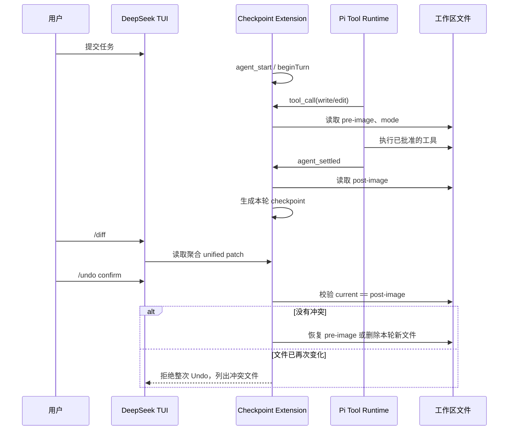

# 本轮 Diff 与安全文件 Undo

实现基线：Pi `dcfe36c79702ec240b146c45f167ab75ecddd205`，SDK `0.80.7`。

## 目标

让用户批准 Pi `write/edit` 后可以集中审阅本轮增量，并在不破坏任务开始前已有修改的前提下撤销。它是产品层文件 checkpoint，不是 Git 替代品、OS 沙箱或完整任务回滚。

## Pi 边界

Pi 核心没有内置工作区回滚。上游 `packages/coding-agent/examples/extensions/git-checkpoint.ts` 使用 `turn_start`、`session_before_fork` 和 `git stash create/apply` 展示 Extension checkpoint；`packages/coding-agent/docs/quickstart.md` 也建议通过 Git 或其他 checkpoint 工作流实现回滚。

本项目继续复用 Pi Extension 生命周期，但不直接执行 `stash apply`。原因是工作区可能在 Agent 启动前已经有用户的未提交修改，宽泛恢复会把这些状态与 Agent 本轮增量混在一起。

## 调用链



## 状态与持久化

- 每次 `agent_start` 创建 recording turn。
- 只为通过现有审批和路径策略的 `write/edit` 保存第一次 pre-image。
- `agent_settled` 保存最终 post-image；同一文件本轮多次编辑仍只形成一个前后差异。
- 只读轮次不会覆盖最近一个可撤销的修改 checkpoint。
- 每个 Session 只保留最新 checkpoint，位置为产品 Session 目录下的 `.checkpoints/<session-id>.json`。
- 文件使用 `0600`，目录使用 `0700`；内容以本地 base64 保存，不进入 Session JSONL、终端输出或 Git。
- `--ephemeral` 内存 Session 只在当前进程保留 checkpoint，不写磁盘。
- Resume 时按 Session ID 加载；Undo 成功后删除持久化文件。

## 用户交互

```text
/diff
/undo
/undo confirm
```

`/diff` 使用 Pi 导出的 `generateUnifiedPatch()`，只比较本轮记录的 pre/post-image。`/undo` 只展示文件范围和边界，必须显式输入 `/undo confirm` 才写磁盘。

Undo 成功只恢复文件，Session 对话树保持不变。后续应提交一条纠正指令，让模型知道工作区已经回退。

## 安全边界

- 任务开始前已有的脏内容会作为 pre-image 保留。
- Undo 写入前先检查所有文件；任一文件与 post-image 不一致时，整次拒绝，避免半数文件先被覆盖。
- 新文件恢复为删除；已有文件恢复内容和权限位。
- Bash 可能修改任意文件、依赖、数据库或外部系统，只做醒目标记，不纳入自动 Undo 保证。
- 用户在 Agent 尚未 settled 时并发修改同一文件，无法可靠区分作者；活动工具执行期间不应手工编辑同一目标。
- checkpoint 是本机明文源码快照，虽然权限收紧，仍不应用于不可信共享主机。

## 验证

`test/checkpoints.test.ts` 覆盖已有脏文件、新文件、同文件多次编辑、多文件冲突整次拒绝、文件权限、Bash 边界、只读轮次、Resume 和 Pi Extension 接线。`test/interactive.test.ts` 覆盖 80×24 下的 Diff 卡片、二次确认和 Undo 完成反馈。
