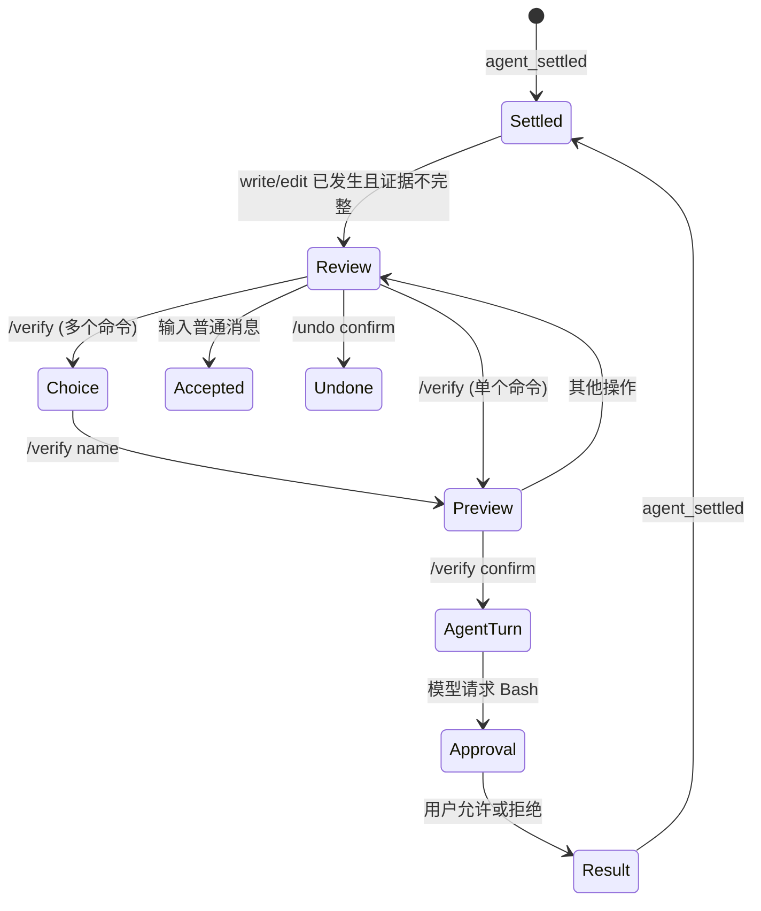

# 显式验证闭环

> 实现日期：2026-07-16
> 项目开发起点：`17ff2df226a4447846d5386a8f051ce405e9b57e`
> Pi 研究基线：`dcfe36c79702ec240b146c45f167ab75ecddd205`
> Pi SDK：`@earendil-works/pi-coding-agent@0.80.7`

## 1. 目标

Completion Evidence 能发现“文件改了，但没有看 diff 或跑检查”，却不应该偷偷消费一次模型请求或执行项目脚本。本功能把下一步收敛为三个可见动作：`/diff` 审阅、`/verify` 验证、`/undo` 恢复；用户继续输入普通任务则表示接受当前状态。

## 2. 状态与请求边界



- `src/interactive.ts` 的 `InteractiveMode.handleVerify()` 管理预览与确认；预览只读本地入口，不调用 `AgentSession.prompt()`。
- 多个项目命令先列出名称，`/verify <name>` 再预览；确认必须引用刚刚展示的同一个候选命令，直接输入 `/verify confirm` 会被拒绝。
- 信任被撤销或 `/resources off` 后清除已预览项目命令，旧预览不能继续确认。
- 确认后调用安装版 Pi SDK `AgentSession.prompt()`，仍由 Pi 负责 Agent Loop、Tool Result 回填和 settled 事件。本项目不复制循环。
- 验证提示要求不修改文件，并且只运行展示过的命令；真正的执行边界仍由既有 Bash 审批控制。Prompt 不是权限系统。

## 3. 候选发现

`src/validation-suggestions.ts` 的 `discoverValidationSuggestions()` 分两层发现。

第一层是可选的 `.deepseek-code/validation.json`。它与 AGENTS/Skills/Prompts 共用 Project Trust 决策：未信任时启动流程只通过文件存在性把来源列在信任卡中，不读取内容；同时满足“项目已信任”和“项目资源已启用”才读取。格式为：

```json
{
  "commands": [
    { "name": "unit", "command": "npm test", "description": "Fast unit tests" },
    { "name": "full", "command": "npm run check && npm test", "description": "Full local gate" }
  ]
}
```

读取边界：

- 文件不超过 64 KiB，必须是工作区内的普通文件，解析真实路径后拒绝符号链接逃逸。
- `commands` 必须包含 1–20 项，名称唯一且匹配 `[a-z0-9][a-z0-9:_-]{0,31}`。
- 命令去除首尾空白后必须是 1–1000 字符的单行，拒绝 CR/LF/NUL；描述可选且不超过 200 字符。
- 文件存在但无效时明确失败，不静默使用 manifest 候选，以免用户误以为执行的是项目声明命令。

第二层仅在项目配置未启用或不存在时使用固定 manifest fallback：

| 入口 | 候选 |
|---|---|
| `package.json` | 按 `check → test → lint → build` 选择第一个已声明脚本，并尊重 npm/pnpm/yarn/bun `packageManager` |
| `pyproject.toml` | `python -m pytest` |
| `Cargo.toml` | `cargo test` |
| `go.mod` | `go test ./...` |
| `pom.xml` | `mvn test` |
| `gradlew` | `./gradlew test` |

fallback 不读取任意源码、不解析脚本正文、不执行探测命令。没有已知入口时给出 `NO SUGGESTION`，让用户自己运行检查或明确告诉 Agent 命令，而不是猜测。

## 4. 长输出与失败

本项目的 TUI 工具结果摘要由 `src/interactive.ts` 的 `toolResultSummary()` 限制为 240 字符并脱敏。模型侧继续复用 Pi Bash：本地 Pi `packages/coding-agent/src/core/tools/bash.ts` 的 `createBashTool()` 使用 `OutputAccumulator`，按行数/字节截断，并在截断时保存完整输出到 `pi-bash` 临时文件、把路径附在 Tool Result 中。因此本项目不再实现第二套进程或日志截断器。

Completion Evidence 根据 `tool_execution_start/end` 记录候选检查的 passed/failed。验证失败不会被包装成成功；用户可以根据短摘要继续修复，也可以先 `/undo`。

## 5. 已知边界

- 项目配置只声明可选择的本地命令，不会根据修改文件自动选择最相关的一条。
- manifest 候选是保守建议，只代表当前最窄入口，不等于完整 CI。
- 模型理论上仍可提出其他工具调用；现有工具审批负责最终阻断或授权。
- `/verify` 只对最近可用的 write/edit checkpoint 开放；Bash 产生的文件变化不被误称为可验证 checkpoint。
- 当前没有自动 Completion Gate，也没有后台检查。

## 6. 自动化覆盖

- package manager 与脚本优先级、损坏 manifest、Python fallback、未知项目。
- 项目配置的信任门、多命令、单行/数量限制、无效配置 fail-closed 和符号链接逃逸。
- `/verify` 列表与命名预览为零请求、未知名称、无预览确认失败、资源关闭后预览失效、确认恰好一次请求。
- 无 checkpoint 拒绝、通过/失败 Evidence、长结果 TUI 截断。
- settled 卡片显示 `/diff · /verify · /undo`，且明确确认前无额外请求。
- 自动化全部使用替身 Session 和临时目录，不调用真实 API。

2026-07-16 真实 Smoke 使用 `deepseek-v4-flash + high + ask` 在隔离临时 Git 仓库完成：write 创建测试文件 → `/verify` 预览时 Session token 不变 → `/verify confirm` 新增一轮 → 模型请求精确 `npm run check` → 用户批准 → 退出码 0 → Evidence 显示 `npm run check:passed`。只记录模型 ID、状态序列和成功摘要，临时工作区与隔离 Session 已清理。
